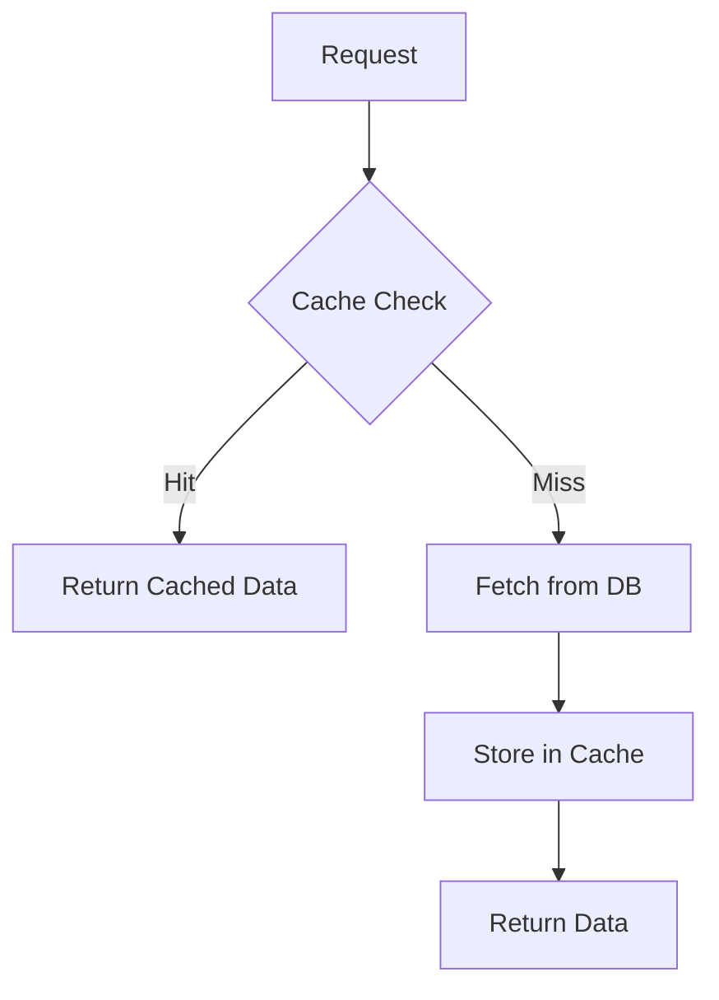
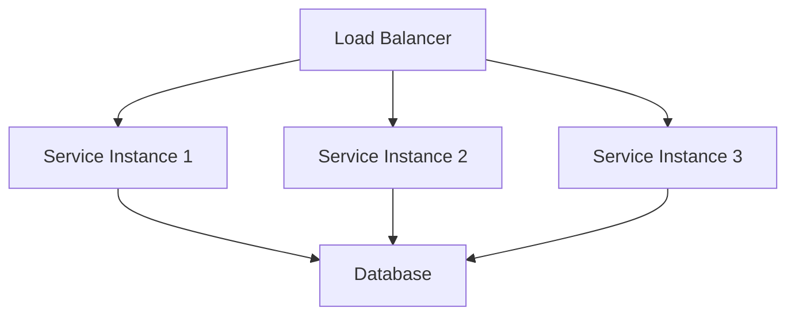

# Performance Optimization Guidelines

## Overview
This document outlines the performance optimization strategies for the restaurant management system, including caching, database optimization, and service performance tuning.

## Caching Strategy

### 1. Application Level Caching


#### Cache Implementation
```typescript
@Injectable()
export class CacheService {
  constructor(
    private readonly redis: Redis,
    private readonly config: ConfigService,
  ) {}

  async get<T>(key: string): Promise<T | null> {
    const data = await this.redis.get(key);
    return data ? JSON.parse(data) : null;
  }

  async set(key: string, value: any, ttl?: number): Promise<void> {
    await this.redis.set(
      key,
      JSON.stringify(value),
      'EX',
      ttl || this.config.get('CACHE_TTL'),
    );
  }

  async invalidate(pattern: string): Promise<void> {
    const keys = await this.redis.keys(pattern);
    if (keys.length) {
      await this.redis.del(...keys);
    }
  }
}
```

### 2. Cache Invalidation Strategy
- Time-based invalidation
- Event-based invalidation
- Manual invalidation
- Partial invalidation
- Cache warming

## Database Optimization

### 1. Query Optimization
```sql
-- Example of optimized query
EXPLAIN ANALYZE
SELECT o.id, o.status, c.name, p.total
FROM orders o
JOIN customers c ON o.customer_id = c.id
JOIN payments p ON o.id = p.order_id
WHERE o.status = 'PENDING'
  AND o.created_at >= NOW() - INTERVAL '24 hours'
ORDER BY o.created_at DESC
LIMIT 100;
```

### 2. Indexing Strategy
```sql
-- Example indexes
CREATE INDEX idx_orders_status ON orders(status);
CREATE INDEX idx_orders_customer ON orders(customer_id);
CREATE INDEX idx_orders_created ON orders(created_at);
CREATE INDEX idx_payments_order ON payments(order_id);
```

### 3. Database Configuration
```ini
# PostgreSQL Configuration
max_connections = 200
shared_buffers = 4GB
effective_cache_size = 12GB
maintenance_work_mem = 1GB
checkpoint_completion_target = 0.9
wal_buffers = 16MB
default_statistics_target = 100
random_page_cost = 1.1
effective_io_concurrency = 200
work_mem = 10485kB
min_wal_size = 1GB
max_wal_size = 4GB
```

## Service Performance

### 1. API Optimization
```typescript
@Controller('orders')
export class OrderController {
  @Get()
  @CacheKey('orders:list')
  @CacheTTL(60)
  async getOrders(@Query() query: OrderQueryDto) {
    return this.orderService.getOrders(query);
  }

  @Post()
  @UseInterceptors(TransactionInterceptor)
  async createOrder(@Body() data: CreateOrderDto) {
    return this.orderService.createOrder(data);
  }
}
```

### 2. Batch Processing
```typescript
@Injectable()
export class BatchProcessor {
  async processOrders(orders: Order[]): Promise<void> {
    const batchSize = 100;
    for (let i = 0; i < orders.length; i += batchSize) {
      const batch = orders.slice(i, i + batchSize);
      await this.processBatch(batch);
    }
  }

  private async processBatch(batch: Order[]): Promise<void> {
    // Process batch of orders
  }
}
```

## Load Balancing

### 1. Service Distribution


### 2. Load Balancer Configuration
```nginx
upstream api_servers {
    server api1.example.com;
    server api2.example.com;
    server api3.example.com;
    
    least_conn;
    keepalive 32;
}

server {
    listen 80;
    server_name api.example.com;

    location / {
        proxy_pass http://api_servers;
        proxy_http_version 1.1;
        proxy_set_header Upgrade $http_upgrade;
        proxy_set_header Connection 'upgrade';
        proxy_set_header Host $host;
        proxy_cache_bypass $http_upgrade;
    }
}
```

## Monitoring and Metrics

### 1. Performance Metrics
```typescript
@Injectable()
export class MetricsService {
  private readonly metrics: Map<string, number> = new Map();

  recordMetric(name: string, value: number): void {
    this.metrics.set(name, value);
  }

  getMetrics(): Map<string, number> {
    return this.metrics;
  }
}
```

### 2. Monitoring Dashboard
```typescript
@Controller('metrics')
export class MetricsController {
  @Get()
  async getMetrics(): Promise<MetricsDto> {
    return {
      responseTime: await this.getAverageResponseTime(),
      errorRate: await this.getErrorRate(),
      throughput: await this.getThroughput(),
      cacheHitRate: await this.getCacheHitRate(),
    };
  }
}
```

## Performance Testing

### 1. Load Testing
```typescript
describe('Order Service Performance', () => {
  it('should handle 1000 concurrent orders', async () => {
    const orders = generateTestOrders(1000);
    const startTime = Date.now();
    
    await Promise.all(orders.map(order => 
      orderService.createOrder(order)
    ));
    
    const duration = Date.now() - startTime;
    expect(duration).toBeLessThan(5000);
  });
});
```

### 2. Stress Testing
```typescript
describe('System Stress Test', () => {
  it('should maintain performance under load', async () => {
    const metrics = await stressTest({
      duration: 300,
      users: 1000,
      rampUp: 60,
      endpoints: [
        { path: '/orders', method: 'POST', weight: 0.3 },
        { path: '/menu', method: 'GET', weight: 0.4 },
        { path: '/payments', method: 'POST', weight: 0.3 },
      ],
    });

    expect(metrics.errorRate).toBeLessThan(0.01);
    expect(metrics.avgResponseTime).toBeLessThan(200);
  });
});
```

## Optimization Checklist

### 1. Application Level
- [ ] Implement caching strategy
- [ ] Optimize database queries
- [ ] Use connection pooling
- [ ] Implement batch processing
- [ ] Optimize API responses

### 2. Database Level
- [ ] Create appropriate indexes
- [ ] Optimize table structure
- [ ] Configure database parameters
- [ ] Implement partitioning
- [ ] Set up replication

### 3. Infrastructure Level
- [ ] Configure load balancing
- [ ] Set up monitoring
- [ ] Implement auto-scaling
- [ ] Configure CDN
- [ ] Optimize network settings

### 4. Code Level
- [ ] Implement lazy loading
- [ ] Use async/await properly
- [ ] Optimize loops and conditions
- [ ] Implement proper error handling
- [ ] Use appropriate data structures 