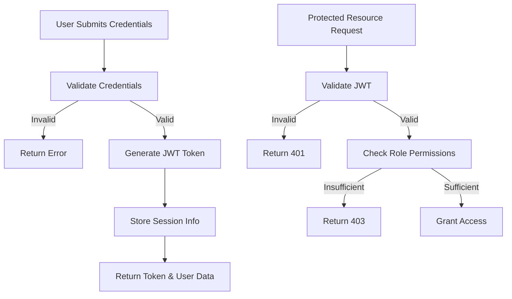
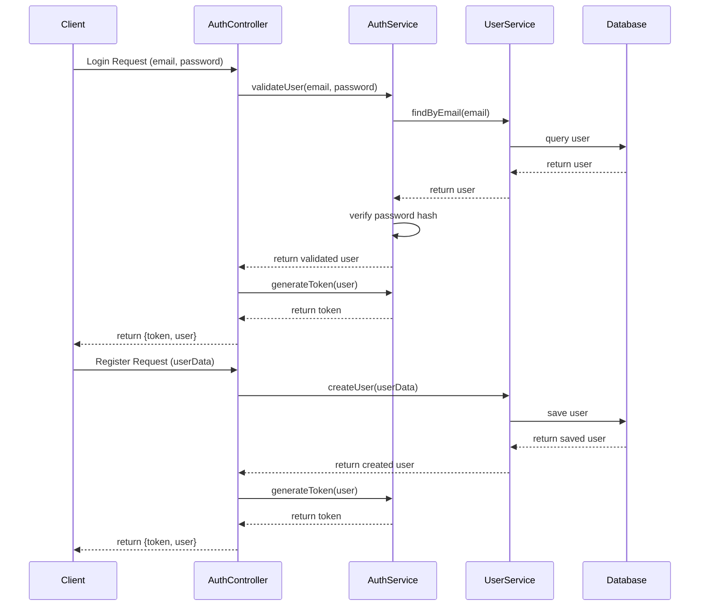

# Authentication System Documentation

## Overview
The authentication system manages user access control and session management across different roles in the restaurant management system.

## Workflow Diagram



## Sequence Diagram



## NestJS Implementation

### Module Structure
```typescript
// auth.module.ts
@Module({
  imports: [
    PassportModule.register({ defaultStrategy: 'jwt' }),
    JwtModule.register({
      secret: process.env.JWT_SECRET,
      signOptions: { expiresIn: '1d' },
    }),
    UsersModule,
  ],
  controllers: [AuthController],
  providers: [AuthService, JwtStrategy],
  exports: [AuthService, JwtStrategy],
})
export class AuthModule {}
```

### Service Implementation
```typescript
// auth.service.ts
@Injectable()
export class AuthService {
  constructor(
    private usersService: UsersService,
    private jwtService: JwtService,
  ) {}

  async validateUser(email: string, password: string): Promise<any> {
    const user = await this.usersService.findByEmail(email);
    if (user && await bcrypt.compare(password, user.password)) {
      const { password, ...result } = user;
      return result;
    }
    return null;
  }

  async login(user: any) {
    const payload = { email: user.email, sub: user.id, role: user.role };
    return {
      access_token: this.jwtService.sign(payload),
      user,
    };
  }
}
```

### Guards
```typescript
// auth.guard.ts
@Injectable()
export class RolesGuard implements CanActivate {
  constructor(private reflector: Reflector) {}

  canActivate(context: ExecutionContext): boolean {
    const requiredRoles = this.reflector.getAllAndOverride<Role[]>('roles', [
      context.getHandler(),
      context.getClass(),
    ]);
    
    if (!requiredRoles) {
      return true;
    }
    
    const { user } = context.switchToHttp().getRequest();
    return requiredRoles.some((role) => user.role === role);
  }
}
```

## Database Schema (Prisma)

```prisma
model User {
  id            String      @id @default(auto()) @map("_id") @db.ObjectId
  email         String      @unique
  password      String
  name          String
  phone         String?
  role          Role        @default(CLIENT)
  branchId      String?     @db.ObjectId
  branch        Branch?     @relation(fields: [branchId], references: [id])
  clientOrders  Order[]     @relation("ClientOrders")
  deliveryOrders Order[]    @relation("DeliveryOrders")
  notifications Notification[]
  createdAt     DateTime    @default(now())
  updatedAt     DateTime    @updatedAt
}

enum Role {
  SUPER_ADMIN
  BRANCH_ADMIN
  CASHIER
  DELIVERY
  CLIENT
}
```

## Integration Points

### Authentication → Users
- Authentication system verifies user credentials
- User management system provides user data and role information

### Authentication → Orders
- User role determines order management capabilities
- Authentication guards protect order endpoints based on roles

### Authentication → Branches
- Admin roles control branch management
- Branch-specific access controlled by user role and branch assignment

## Testing Strategy

### Unit Tests
```typescript
// auth.service.spec.ts
describe('AuthService', () => {
  let service: AuthService;
  let usersService: UsersService;
  
  beforeEach(async () => {
    const module = await Test.createTestingModule({
      providers: [
        AuthService,
        {
          provide: UsersService,
          useValue: {
            findByEmail: jest.fn(),
          },
        },
        {
          provide: JwtService,
          useValue: {
            sign: jest.fn(() => 'test-token'),
          },
        },
      ],
    }).compile();
    
    service = module.get<AuthService>(AuthService);
    usersService = module.get<UsersService>(UsersService);
  });
  
  it('should validate a user with correct credentials', async () => {
    // Test implementation
  });
  
  it('should not validate a user with incorrect credentials', async () => {
    // Test implementation
  });
});
```

### E2E Tests
```typescript
// auth.e2e-spec.ts
describe('Auth (e2e)', () => {
  let app: INestApplication;
  
  beforeEach(async () => {
    const moduleFixture = await Test.createTestingModule({
      imports: [AppModule],
    }).compile();
    
    app = moduleFixture.createNestApplication();
    await app.init();
  });
  
  it('/auth/login (POST) - should return token for valid credentials', () => {
    // Test implementation
  });
  
  it('/auth/login (POST) - should reject invalid credentials', () => {
    // Test implementation
  });
});
``` 