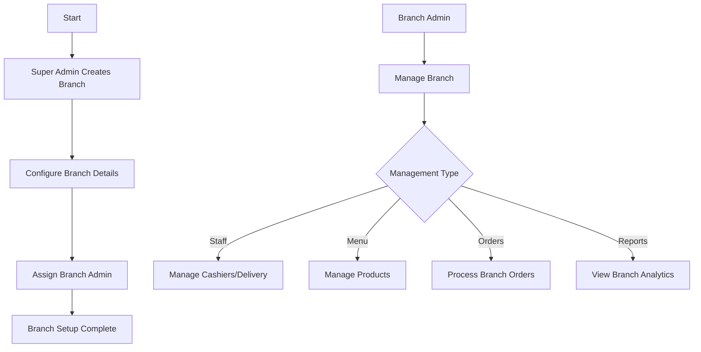
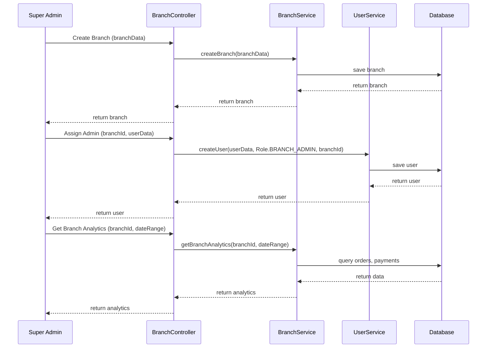

# Branch Management Documentation

## Overview
The branch management system handles restaurant locations, their operational settings, and staff assignments.

## Workflow Diagram



## Sequence Diagram



## NestJS Implementation

### Module Structure
```typescript
// branches.module.ts
@Module({
  imports: [UsersModule],
  controllers: [BranchesController],
  providers: [BranchesService],
  exports: [BranchesService],
})
export class BranchesModule {}
```

### Controller
```typescript
// branches.controller.ts
@Controller('branches')
export class BranchesController {
  constructor(
    private readonly branchesService: BranchesService,
    private readonly usersService: UsersService,
  ) {}

  @Post()
  @UseGuards(JwtAuthGuard, RolesGuard)
  @Roles(Role.SUPER_ADMIN)
  create(@Body() createBranchDto: CreateBranchDto) {
    return this.branchesService.create(createBranchDto);
  }

  @Get()
  @UseGuards(JwtAuthGuard)
  findAll(@Request() req) {
    if (req.user.role === Role.SUPER_ADMIN) {
      return this.branchesService.findAll();
    } else if (req.user.role === Role.BRANCH_ADMIN || 
               req.user.role === Role.CASHIER ||
               req.user.role === Role.DELIVERY) {
      return this.branchesService.findById(req.user.branchId);
    } else {
      // For clients, return all branches (they can choose any)
      return this.branchesService.findAll();
    }
  }

  @Get(':id')
  @UseGuards(JwtAuthGuard)
  findOne(@Param('id') id: string, @Request() req) {
    if (req.user.role !== Role.SUPER_ADMIN && 
        req.user.role !== Role.CLIENT && 
        req.user.branchId !== id) {
      throw new ForbiddenException('Cannot access other branch data');
    }
    return this.branchesService.findById(id);
  }

  @Get(':id/analytics')
  @UseGuards(JwtAuthGuard, RolesGuard)
  @Roles(Role.SUPER_ADMIN, Role.BRANCH_ADMIN)
  getBranchAnalytics(
    @Param('id') id: string, 
    @Query() query: AnalyticsQueryDto,
    @Request() req
  ) {
    if (req.user.role === Role.BRANCH_ADMIN && req.user.branchId !== id) {
      throw new ForbiddenException('Cannot access other branch analytics');
    }
    return this.branchesService.getBranchAnalytics(id, query);
  }

  // Other endpoints
}
```

### Service
```typescript
// branches.service.ts
@Injectable()
export class BranchesService {
  constructor(private prisma: PrismaService) {}

  async create(createBranchDto: CreateBranchDto): Promise<Branch> {
    return this.prisma.branch.create({
      data: createBranchDto,
    });
  }

  async findAll(): Promise<Branch[]> {
    return this.prisma.branch.findMany();
  }

  async findById(id: string): Promise<Branch> {
    return this.prisma.branch.findUnique({
      where: { id },
      include: {
        staff: true,
        products: true,
      },
    });
  }

  async getBranchAnalytics(
    branchId: string, 
    query: AnalyticsQueryDto
  ): Promise<any> {
    const { startDate, endDate } = query;
    
    // Get orders
    const orders = await this.prisma.order.findMany({
      where: {
        branchId,
        createdAt: {
          gte: startDate,
          lte: endDate,
        },
      },
      include: {
        payment: true,
        items: true,
      },
    });
    
    // Process analytics
    // ...calculation logic
    
    return {
      totalOrders: orders.length,
      totalRevenue: calculateTotalRevenue(orders),
      ordersByType: groupOrdersByType(orders),
      // ...other analytics
    };
  }

  // Other methods
}
```

## Database Schema (Prisma)

```prisma
model Branch {
  id          String    @id @default(auto()) @map("_id") @db.ObjectId
  name        String
  address     String
  location    Json      // {latitude: number, longitude: number}
  staff       User[]    // Related staff members
  products    Product[]
  orders      Order[]
  createdAt   DateTime  @default(now())
  updatedAt   DateTime  @updatedAt
}
```

## Integration Points

### Branches → Users
- Branch admins are assigned to specific branches
- Cashiers and delivery staff are linked to branches 

### Branches → Products
- Products are branch-specific
- Branch admins manage their branch's menu

### Branches → Orders
- Orders are associated with specific branches
- Branch-specific analytics are derived from orders

## Testing Strategy

### Unit Tests
```typescript
// branches.service.spec.ts
describe('BranchesService', () => {
  let service: BranchesService;
  let prisma: PrismaService;
  
  beforeEach(async () => {
    const module = await Test.createTestingModule({
      providers: [
        BranchesService,
        {
          provide: PrismaService,
          useValue: {
            branch: {
              create: jest.fn(),
              findUnique: jest.fn(),
              findMany: jest.fn(),
              update: jest.fn(),
              delete: jest.fn(),
            },
            order: {
              findMany: jest.fn(),
            },
          },
        },
      ],
    }).compile();
    
    service = module.get<BranchesService>(BranchesService);
    prisma = module.get<PrismaService>(PrismaService);
  });
  
  it('should create a branch', async () => {
    // Test implementation
  });
  
  it('should retrieve branch analytics', async () => {
    // Test implementation
  });
});
```

### E2E Tests
```typescript
// branches.e2e-spec.ts
describe('Branches (e2e)', () => {
  let app: INestApplication;
  let authToken: string;
  
  beforeEach(async () => {
    const moduleFixture = await Test.createTestingModule({
      imports: [AppModule],
    }).compile();
    
    app = moduleFixture.createNestApplication();
    await app.init();
    
    // Get auth token for super admin
    // ...login logic
  });
  
  it('/branches (POST) - should create a new branch', () => {
    // Test implementation with auth token
  });
  
  it('/branches/:id/analytics (GET) - should return branch analytics', () => {
    // Test implementation with auth token
  });
});
``` 