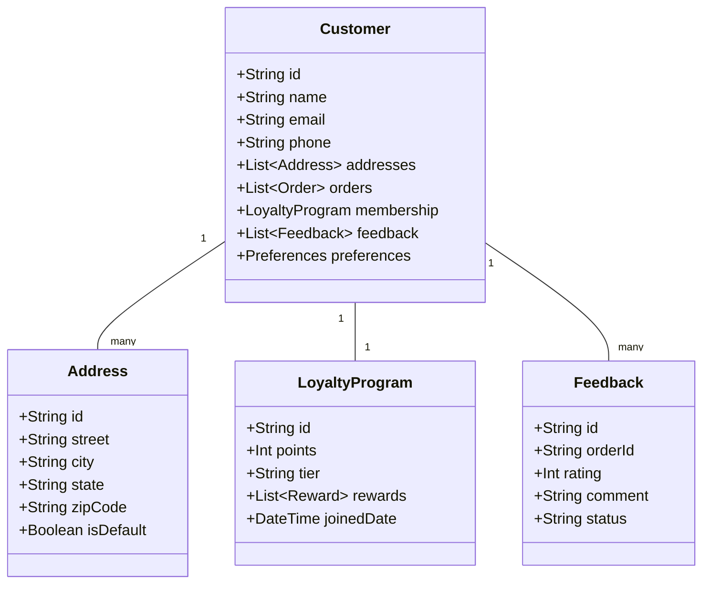

# Customer Management System

## Overview
This document outlines the customer management system, including customer profiles, order history, loyalty program, and feedback management.

## Customer Structure



## Database Schema (Prisma)

```prisma
model Customer {
  id            String         @id @default(auto()) @map("_id") @db.ObjectId
  name          String
  email         String         @unique
  phone         String
  addresses     Address[]
  orders        Order[]
  loyalty       LoyaltyProgram?
  feedback      Feedback[]
  preferences   Json?
  createdAt     DateTime       @default(now())
  updatedAt     DateTime       @updatedAt
}

model Address {
  id          String   @id @default(auto()) @map("_id") @db.ObjectId
  street      String
  city        String
  state       String
  zipCode     String
  isDefault   Boolean  @default(false)
  customerId  String   @db.ObjectId
  customer    Customer @relation(fields: [customerId], references: [id])
  createdAt   DateTime @default(now())
  updatedAt   DateTime @updatedAt
}

model LoyaltyProgram {
  id          String   @id @default(auto()) @map("_id") @db.ObjectId
  points      Int      @default(0)
  tier        String   @default("BRONZE")
  joinedDate  DateTime @default(now())
  customerId  String   @unique @db.ObjectId
  customer    Customer @relation(fields: [customerId], references: [id])
  rewards     Reward[]
  createdAt   DateTime @default(now())
  updatedAt   DateTime @updatedAt
}

model Feedback {
  id          String   @id @default(auto()) @map("_id") @db.ObjectId
  orderId     String   @db.ObjectId
  order       Order    @relation(fields: [orderId], references: [id])
  rating      Int
  comment     String?
  status      String   @default("PENDING")
  customerId  String   @db.ObjectId
  customer    Customer @relation(fields: [customerId], references: [id])
  createdAt   DateTime @default(now())
  updatedAt   DateTime @updatedAt
}
```

## Implementation Details

### Customer Service
```typescript
@Injectable()
export class CustomerService {
  constructor(
    private prisma: PrismaService,
    private notificationService: NotificationService,
  ) {}

  async createCustomer(createCustomerDto: CreateCustomerDto): Promise<Customer> {
    const customer = await this.prisma.customer.create({
      data: {
        name: createCustomerDto.name,
        email: createCustomerDto.email,
        phone: createCustomerDto.phone,
        addresses: {
          create: createCustomerDto.addresses.map(address => ({
            street: address.street,
            city: address.city,
            state: address.state,
            zipCode: address.zipCode,
            isDefault: address.isDefault,
          })),
        },
        loyalty: {
          create: {
            points: 0,
            tier: 'BRONZE',
          },
        },
      },
      include: {
        addresses: true,
        loyalty: true,
      },
    });

    // Send welcome email
    await this.notificationService.sendWelcomeEmail(customer);

    return customer;
  }

  async updateLoyaltyPoints(
    customerId: string,
    points: number
  ): Promise<LoyaltyProgram> {
    const loyalty = await this.prisma.loyaltyProgram.findUnique({
      where: { customerId },
    });

    const newPoints = loyalty.points + points;
    const newTier = this.calculateTier(newPoints);

    return this.prisma.loyaltyProgram.update({
      where: { customerId },
      data: {
        points: newPoints,
        tier: newTier,
      },
    });
  }

  async submitFeedback(
    customerId: string,
    orderId: string,
    feedbackDto: FeedbackDto
  ): Promise<Feedback> {
    const feedback = await this.prisma.feedback.create({
      data: {
        orderId,
        customerId,
        rating: feedbackDto.rating,
        comment: feedbackDto.comment,
      },
    });

    // Notify relevant staff
    await this.notificationService.sendFeedbackNotification(feedback);

    return feedback;
  }

  private calculateTier(points: number): string {
    if (points >= 1000) return 'GOLD';
    if (points >= 500) return 'SILVER';
    return 'BRONZE';
  }
}
```

## Business Rules
1. Email must be unique
2. Phone number required for delivery
3. Default address must be set
4. Loyalty points expire after 1 year
5. Feedback must be submitted within 7 days
6. Tier upgrades are automatic
7. Customer preferences are optional

## Error Handling
1. Duplicate email addresses
2. Invalid phone numbers
3. Address validation failures
4. Points calculation errors
5. Feedback submission limits

## Testing Strategy
1. Unit tests for customer creation
2. Integration tests for loyalty program
3. E2E tests for feedback system
4. Performance tests for large customer bases
5. Validation tests for business rules 