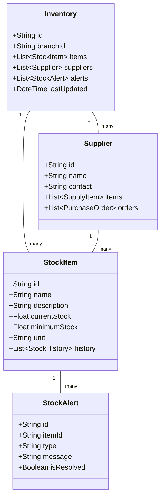

# Inventory Management System

## Overview
This document outlines the inventory management system, including stock tracking, alerts, supplier management, and reporting.

## Inventory Structure



## Database Schema (Prisma)

```prisma
model Inventory {
  id          String      @id @default(auto()) @map("_id") @db.ObjectId
  branchId    String      @db.ObjectId
  branch      Branch      @relation(fields: [branchId], references: [id])
  items       StockItem[]
  suppliers   Supplier[]
  alerts      StockAlert[]
  lastUpdated DateTime    @updatedAt
  createdAt   DateTime    @default(now())
}

model StockItem {
  id           String         @id @default(auto()) @map("_id") @db.ObjectId
  name         String
  description  String?
  currentStock Float
  minimumStock Float
  unit         String
  inventoryId  String         @db.ObjectId
  inventory    Inventory      @relation(fields: [inventoryId], references: [id])
  history      StockHistory[]
  alerts       StockAlert[]
  createdAt    DateTime       @default(now())
  updatedAt    DateTime       @updatedAt
}

model Supplier {
  id          String          @id @default(auto()) @map("_id") @db.ObjectId
  name        String
  contact     String
  email       String?
  phone       String?
  inventoryId String          @db.ObjectId
  inventory   Inventory       @relation(fields: [inventoryId], references: [id])
  items       SupplyItem[]
  orders      PurchaseOrder[]
  createdAt   DateTime        @default(now())
  updatedAt   DateTime        @updatedAt
}

model StockAlert {
  id          String     @id @default(auto()) @map("_id") @db.ObjectId
  type        AlertType
  message     String
  isResolved  Boolean    @default(false)
  itemId      String     @db.ObjectId
  item        StockItem  @relation(fields: [itemId], references: [id])
  createdAt   DateTime   @default(now())
  updatedAt   DateTime   @updatedAt
}

enum AlertType {
  LOW_STOCK
  EXPIRING
  EXPIRED
  CUSTOM
}
```

## Implementation Details

### Inventory Service
```typescript
@Injectable()
export class InventoryService {
  constructor(
    private prisma: PrismaService,
    private notificationService: NotificationService,
  ) {}

  async updateStock(
    itemId: string,
    quantity: number,
    type: 'ADD' | 'REMOVE'
  ): Promise<StockItem> {
    const item = await this.prisma.stockItem.findUnique({
      where: { id: itemId },
    });

    const newStock = type === 'ADD' 
      ? item.currentStock + quantity 
      : item.currentStock - quantity;

    const updatedItem = await this.prisma.stockItem.update({
      where: { id: itemId },
      data: {
        currentStock: newStock,
        history: {
          create: {
            previousStock: item.currentStock,
            newStock,
            type,
            quantity,
          },
        },
      },
    });

    // Check for low stock alert
    if (newStock <= item.minimumStock) {
      await this.createLowStockAlert(itemId);
    }

    return updatedItem;
  }

  async createLowStockAlert(itemId: string): Promise<StockAlert> {
    const alert = await this.prisma.stockAlert.create({
      data: {
        type: AlertType.LOW_STOCK,
        message: 'Stock level is below minimum threshold',
        itemId,
      },
    });

    // Notify relevant staff
    await this.notificationService.sendInventoryAlert(alert);

    return alert;
  }

  async generateInventoryReport(
    branchId: string,
    startDate: Date,
    endDate: Date
  ): Promise<InventoryReport> {
    const items = await this.prisma.stockItem.findMany({
      where: {
        inventory: {
          branchId,
        },
      },
      include: {
        history: {
          where: {
            createdAt: {
              gte: startDate,
              lte: endDate,
            },
          },
        },
      },
    });

    return this.processInventoryReport(items);
  }
}
```

## Business Rules
1. Stock levels must be updated in real-time
2. Low stock alerts trigger at minimum threshold
3. Stock adjustments require authorization
4. Expired items must be removed from inventory
5. Supplier orders must be tracked
6. Inventory reports generated daily
7. Stock history maintained for audit

## Error Handling
1. Invalid stock quantities
2. Duplicate supplier entries
3. System connectivity issues
4. Database constraints
5. Authorization failures

## Testing Strategy
1. Unit tests for stock updates
2. Integration tests for alerts
3. E2E tests for inventory flow
4. Performance tests for large inventories
5. Validation tests for business rules 