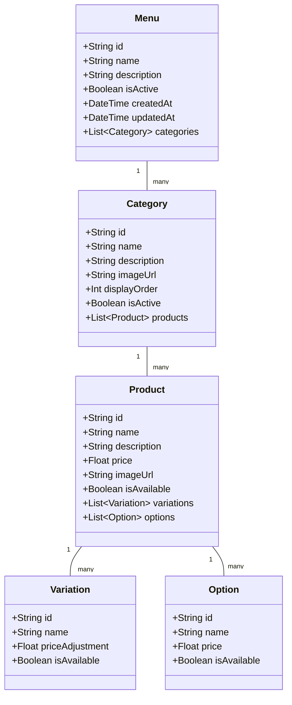

# Menu Management System

## Overview
This document outlines the menu management system, including menu structure, product variations, pricing, and availability management.

## Menu Structure



## Database Schema (Prisma)

```prisma
model Menu {
  id          String     @id @default(auto()) @map("_id") @db.ObjectId
  name        String
  description String?
  isActive    Boolean    @default(true)
  categories  Category[]
  createdAt   DateTime   @default(now())
  updatedAt   DateTime   @updatedAt
}

model Category {
  id          String    @id @default(auto()) @map("_id") @db.ObjectId
  name        String
  description String?
  imageUrl    String?
  displayOrder Int
  isActive    Boolean   @default(true)
  menuId      String    @db.ObjectId
  menu        Menu      @relation(fields: [menuId], references: [id])
  products    Product[]
  createdAt   DateTime  @default(now())
  updatedAt   DateTime  @updatedAt
}

model Product {
  id          String       @id @default(auto()) @map("_id") @db.ObjectId
  name        String
  description String?
  price       Float
  imageUrl    String?
  isAvailable Boolean      @default(true)
  categoryId  String       @db.ObjectId
  category    Category     @relation(fields: [categoryId], references: [id])
  variations  Variation[]
  options     Option[]
  createdAt   DateTime     @default(now())
  updatedAt   DateTime     @updatedAt
}

model Variation {
  id             String   @id @default(auto()) @map("_id") @db.ObjectId
  name           String
  priceAdjustment Float
  isAvailable    Boolean  @default(true)
  productId      String   @db.ObjectId
  product        Product  @relation(fields: [productId], references: [id])
  createdAt      DateTime @default(now())
  updatedAt      DateTime @updatedAt
}

model Option {
  id          String   @id @default(auto()) @map("_id") @db.ObjectId
  name        String
  price       Float
  isAvailable Boolean  @default(true)
  productId   String   @db.ObjectId
  product     Product  @relation(fields: [productId], references: [id])
  createdAt   DateTime @default(now())
  updatedAt   DateTime @updatedAt
}
```

## Implementation Details

### Menu Service
```typescript
@Injectable()
export class MenuService {
  constructor(private prisma: PrismaService) {}

  async createMenu(createMenuDto: CreateMenuDto): Promise<Menu> {
    return this.prisma.menu.create({
      data: {
        name: createMenuDto.name,
        description: createMenuDto.description,
        categories: {
          create: createMenuDto.categories.map(category => ({
            name: category.name,
            description: category.description,
            displayOrder: category.displayOrder,
            products: {
              create: category.products.map(product => ({
                name: product.name,
                description: product.description,
                price: product.price,
                variations: {
                  create: product.variations.map(variation => ({
                    name: variation.name,
                    priceAdjustment: variation.priceAdjustment,
                  })),
                },
                options: {
                  create: product.options.map(option => ({
                    name: option.name,
                    price: option.price,
                  })),
                },
              })),
            },
          })),
        },
      },
      include: {
        categories: {
          include: {
            products: {
              include: {
                variations: true,
                options: true,
              },
            },
          },
        },
      },
    });
  }

  async updateProductAvailability(
    productId: string,
    isAvailable: boolean
  ): Promise<Product> {
    return this.prisma.product.update({
      where: { id: productId },
      data: { isAvailable },
    });
  }

  async getMenuByBranch(branchId: string): Promise<Menu> {
    return this.prisma.menu.findFirst({
      where: {
        categories: {
          some: {
            products: {
              some: {
                branchId,
              },
            },
          },
        },
      },
      include: {
        categories: {
          include: {
            products: {
              where: {
                branchId,
              },
              include: {
                variations: true,
                options: true,
              },
            },
          },
        },
      },
    });
  }
}
```

## Business Rules
1. Each branch can have its own menu
2. Products can be marked as unavailable
3. Price adjustments for variations
4. Options can be added to products
5. Categories have display order
6. Products must belong to a category
7. Menu changes require admin approval

## Error Handling
1. Invalid menu structure
2. Duplicate product names
3. Invalid price values
4. Missing required fields
5. Database constraints

## Testing Strategy
1. Unit tests for menu creation
2. Integration tests for product updates
3. E2E tests for menu browsing
4. Performance tests for large menus
5. Validation tests for business rules 