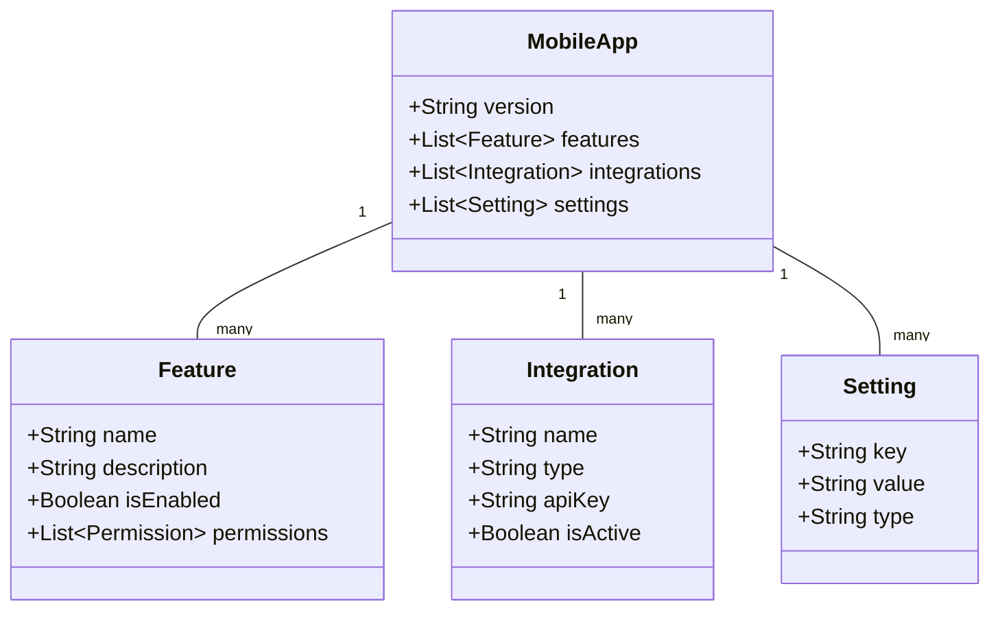

# Mobile App Features

## Overview
This document outlines the mobile application features, including push notifications, real-time tracking, payment integration, and offline capabilities.

## Mobile App Structure



## Database Schema (Prisma)

```prisma
model MobileApp {
  id           String       @id @default(auto()) @map("_id") @db.ObjectId
  version      String
  features     Feature[]
  integrations Integration[]
  settings     Setting[]
  createdAt    DateTime     @default(now())
  updatedAt    DateTime     @updatedAt
}

model Feature {
  id          String    @id @default(auto()) @map("_id") @db.ObjectId
  name        String
  description String?
  isEnabled   Boolean   @default(true)
  permissions Json
  appId       String    @db.ObjectId
  app         MobileApp @relation(fields: [appId], references: [id])
  createdAt   DateTime  @default(now())
  updatedAt   DateTime  @updatedAt
}

model Integration {
  id        String    @id @default(auto()) @map("_id") @db.ObjectId
  name      String
  type      String
  apiKey    String
  isActive  Boolean   @default(true)
  appId     String    @db.ObjectId
  app       MobileApp @relation(fields: [appId], references: [id])
  createdAt DateTime  @default(now())
  updatedAt DateTime  @updatedAt
}

model Setting {
  id        String    @id @default(auto()) @map("_id") @db.ObjectId
  key       String
  value     String
  type      String
  appId     String    @db.ObjectId
  app       MobileApp @relation(fields: [appId], references: [id])
  createdAt DateTime  @default(now())
  updatedAt DateTime  @updatedAt
}
```

## Implementation Details

### Mobile App Service
```typescript
@Injectable()
export class MobileAppService {
  constructor(
    private prisma: PrismaService,
    private notificationService: NotificationService,
    private paymentService: PaymentService,
  ) {}

  async initializeApp(): Promise<MobileApp> {
    const app = await this.prisma.mobileApp.create({
      data: {
        version: '1.0.0',
        features: {
          create: [
            {
              name: 'Push Notifications',
              description: 'Real-time order updates',
              isEnabled: true,
              permissions: {
                required: ['NOTIFICATIONS'],
              },
            },
            {
              name: 'Location Services',
              description: 'Branch location and delivery tracking',
              isEnabled: true,
              permissions: {
                required: ['LOCATION'],
              },
            },
            // Additional features...
          ],
        },
        integrations: {
          create: [
            {
              name: 'Firebase',
              type: 'PUSH_NOTIFICATIONS',
              apiKey: process.env.FIREBASE_API_KEY,
              isActive: true,
            },
            {
              name: 'Stripe',
              type: 'PAYMENT',
              apiKey: process.env.STRIPE_API_KEY,
              isActive: true,
            },
            // Additional integrations...
          ],
        },
        settings: {
          create: [
            {
              key: 'offlineMode',
              value: 'true',
              type: 'boolean',
            },
            {
              key: 'cacheDuration',
              value: '3600',
              type: 'number',
            },
            // Additional settings...
          ],
        },
      },
    });

    return app;
  }

  async sendPushNotification(
    userId: string,
    notification: NotificationDto
  ): Promise<void> {
    const device = await this.getUserDevice(userId);
    
    await this.notificationService.sendPush({
      deviceToken: device.token,
      title: notification.title,
      body: notification.body,
      data: notification.data,
    });
  }

  async processMobilePayment(
    orderId: string,
    paymentData: PaymentDto
  ): Promise<PaymentResult> {
    const order = await this.orderService.findOne(orderId);
    
    return this.paymentService.processMobilePayment({
      orderId,
      amount: order.total,
      paymentMethod: paymentData.method,
      deviceInfo: paymentData.deviceInfo,
    });
  }

  async syncOfflineData(
    userId: string,
    offlineData: OfflineDataDto
  ): Promise<void> {
    // Implementation for syncing offline data
    await this.processOfflineOrders(offlineData.orders);
    await this.processOfflinePayments(offlineData.payments);
    await this.updateUserPreferences(offlineData.preferences);
  }
}
```

## Business Rules
1. Push notifications require user consent
2. Location services optional for delivery
3. Offline mode limited to 24 hours
4. Payment methods must be verified
5. Data sync on reconnection
6. Version updates mandatory
7. Feature flags for gradual rollout

## Error Handling
1. Network connectivity issues
2. Payment processing failures
3. Notification delivery failures
4. Data sync conflicts
5. Version compatibility issues

## Testing Strategy
1. Unit tests for core features
2. Integration tests for services
3. E2E tests for user flows
4. Offline functionality tests
5. Performance tests for large datasets 