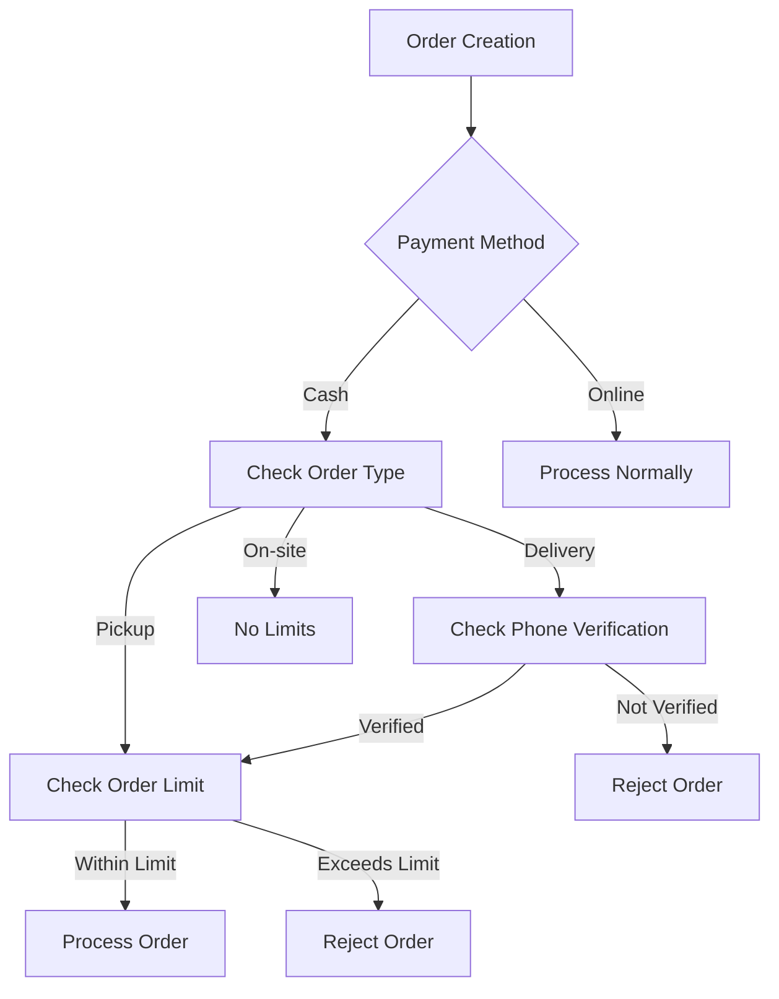
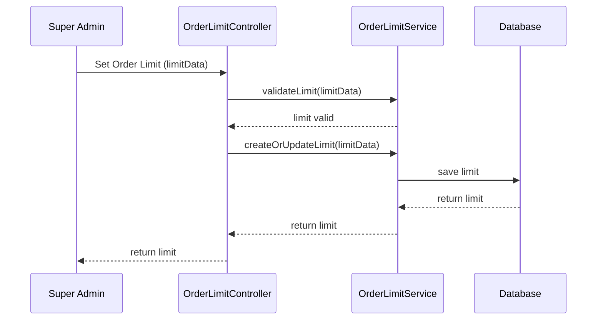

# Order Limits and Cash Order Validation

## Overview
This document outlines the order limit management system and cash order validation rules for the restaurant management system.

## Workflow Diagram



## Order Limits Configuration



## Database Schema (Prisma)

```prisma
model OrderLimit {
  id            String        @id @default(auto()) @map("_id") @db.ObjectId
  orderType     OrderType
  paymentMethod PaymentMethod
  maxAmount     Float
  createdAt     DateTime      @default(now())
  updatedAt     DateTime      @updatedAt
}

enum OrderType {
  DELIVERY
  PICKUP
  ON_SITE
}

enum PaymentMethod {
  CASH
  CREDIT_CARD
  DIGITAL_WALLET
  POS
}
```

## Implementation Details

### Order Limit Service
```typescript
// order-limit.service.ts
@Injectable()
export class OrderLimitService {
  constructor(private prisma: PrismaService) {}

  async getOrderLimit(
    orderType: OrderType,
    paymentMethod: PaymentMethod
  ): Promise<OrderLimit> {
    return this.prisma.orderLimit.findFirst({
      where: {
        orderType,
        paymentMethod,
      },
    });
  }

  async validateOrder(
    orderData: CreateOrderDto,
    user: User
  ): Promise<void> {
    // Check if it's a cash order
    if (orderData.paymentMethod === PaymentMethod.CASH) {
      const orderLimit = await this.getOrderLimit(
        orderData.orderType,
        PaymentMethod.CASH
      );
      
      if (orderData.total > orderLimit.maxAmount) {
        throw new BadRequestException(
          `Cash orders cannot exceed ${orderLimit.maxAmount} SR`
        );
      }
      
      // For online delivery orders, check phone verification
      if (orderData.orderType === OrderType.DELIVERY && !user.phoneVerified) {
        throw new BadRequestException(
          'Phone number must be verified for cash delivery orders'
        );
      }
    }
  }
}
```

### Order Service Integration
```typescript
// orders.service.ts
@Injectable()
export class OrdersService {
  constructor(
    private prisma: PrismaService,
    private orderLimitService: OrderLimitService,
  ) {}

  async create(createOrderDto: CreateOrderDto, user: User): Promise<Order> {
    // Validate order limits
    await this.orderLimitService.validateOrder(createOrderDto, user);
    
    // Process order creation
    return this.prisma.order.create({
      data: {
        ...createOrderDto,
        userId: user.id,
      },
    });
  }
}
```

## Validation Rules

1. **Cash Order Limits**
   - Delivery orders: 100 SR limit (configurable)
   - Pickup orders: 100 SR limit (configurable)
   - On-site orders: No limit

2. **Phone Verification**
   - Required for cash delivery orders
   - Not required for other order types
   - Verification status checked before order processing

3. **Order Limit Configuration**
   - Set by super admin
   - Different limits for different order types
   - Different limits for different payment methods
   - Limits can be updated at any time

## Testing Strategy

### Unit Tests
```typescript
// order-limit.service.spec.ts
describe('OrderLimitService', () => {
  let service: OrderLimitService;
  let prisma: PrismaService;
  
  beforeEach(async () => {
    const module = await Test.createTestingModule({
      providers: [
        OrderLimitService,
        {
          provide: PrismaService,
          useValue: {
            orderLimit: {
              findFirst: jest.fn(),
              create: jest.fn(),
              update: jest.fn(),
            },
          },
        },
      ],
    }).compile();
    
    service = module.get<OrderLimitService>(OrderLimitService);
    prisma = module.get<PrismaService>(PrismaService);
  });
  
  it('should validate cash order within limit', async () => {
    // Test implementation
  });
  
  it('should reject cash order exceeding limit', async () => {
    // Test implementation
  });
  
  it('should require phone verification for cash delivery orders', async () => {
    // Test implementation
  });
});
```

### E2E Tests
```typescript
// order-limits.e2e-spec.ts
describe('Order Limits (e2e)', () => {
  let app: INestApplication;
  
  beforeEach(async () => {
    const moduleFixture = await Test.createTestingModule({
      imports: [AppModule],
    }).compile();
    
    app = moduleFixture.createNestApplication();
    await app.init();
  });
  
  it('/order-limits (POST) - should set order limit', () => {
    // Test implementation
  });
  
  it('/orders (POST) - should enforce cash order limits', () => {
    // Test implementation
  });
});
``` 