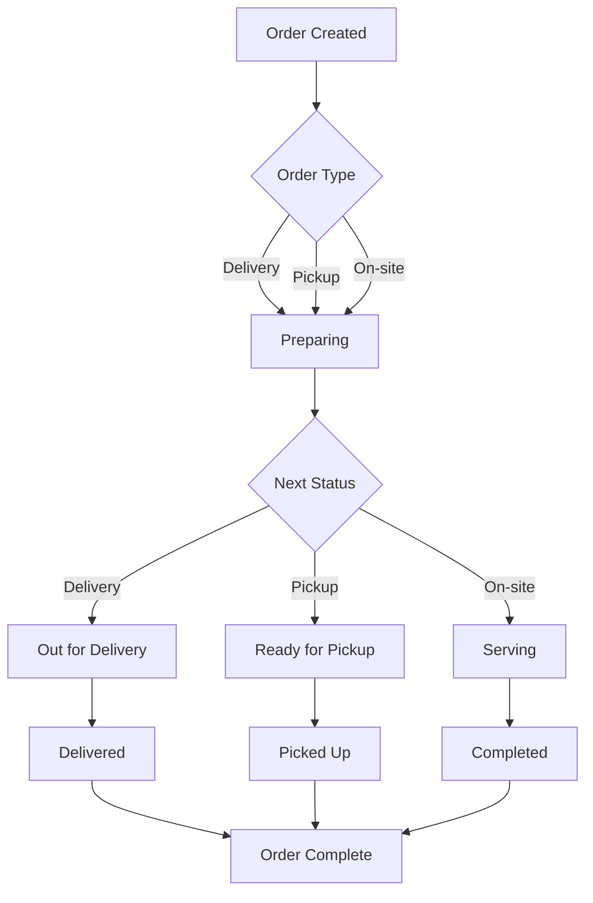
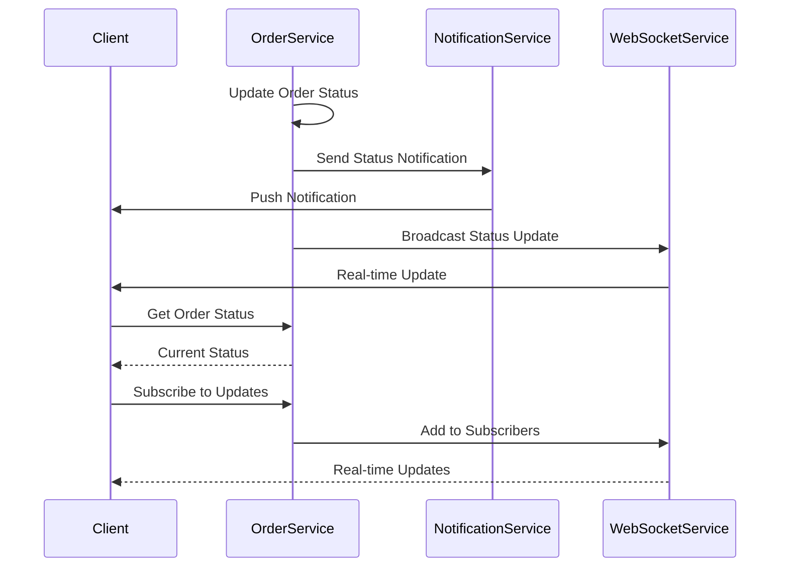

# Order Tracking and Status Management

## Overview
This document outlines the order tracking system and status management for all order types (delivery, pickup, and on-site).

## Order Status Flow



## Status Types

### Delivery Orders
1. **PREPARING**: Order is being prepared in the kitchen
2. **OUT_FOR_DELIVERY**: Order is with delivery personnel
3. **DELIVERED**: Order has been delivered to customer
4. **COMPLETED**: Order is fully processed

### Pickup Orders
1. **PREPARING**: Order is being prepared in the kitchen
2. **READY_FOR_PICKUP**: Order is ready for customer pickup
3. **PICKED_UP**: Customer has collected the order
4. **COMPLETED**: Order is fully processed

### On-site Orders
1. **PREPARING**: Order is being prepared in the kitchen
2. **SERVING**: Order is being served to the table
3. **COMPLETED**: Order is fully processed

## Real-time Updates



## Implementation Details

### Database Schema (Prisma)
```prisma
model Order {
  id            String      @id @default(auto()) @map("_id") @db.ObjectId
  orderNumber   String      @unique
  status        OrderStatus
  type          OrderType
  branchId      String      @db.ObjectId
  branch        Branch      @relation(fields: [branchId], references: [id])
  userId        String?     @db.ObjectId
  user          User?       @relation(fields: [userId], references: [id])
  items         OrderItem[]
  total         Float
  createdAt     DateTime    @default(now())
  updatedAt     DateTime    @updatedAt
}

enum OrderStatus {
  PREPARING
  OUT_FOR_DELIVERY
  DELIVERED
  READY_FOR_PICKUP
  PICKED_UP
  SERVING
  COMPLETED
  CANCELLED
}

enum OrderType {
  DELIVERY
  PICKUP
  ON_SITE
}
```

### Order Service Implementation
```typescript
// order.service.ts
@Injectable()
export class OrderService {
  constructor(
    private prisma: PrismaService,
    private notificationService: NotificationService,
    private webSocketService: WebSocketService,
  ) {}

  async updateStatus(
    orderId: string,
    status: OrderStatus,
    userId: string
  ): Promise<Order> {
    const order = await this.prisma.order.update({
      where: { id: orderId },
      data: { status },
      include: {
        user: true,
        branch: true,
      },
    });

    // Send notification
    await this.notificationService.sendOrderStatusUpdate(
      order.id,
      status,
      order.userId
    );

    // Broadcast real-time update
    await this.webSocketService.broadcastOrderUpdate(order);

    return order;
  }

  async trackOrder(orderId: string): Promise<OrderTracking> {
    const order = await this.prisma.order.findUnique({
      where: { id: orderId },
      include: {
        branch: true,
        user: true,
      },
    });

    return {
      order,
      estimatedTime: this.calculateEstimatedTime(order),
      currentStatus: order.status,
      statusHistory: await this.getStatusHistory(orderId),
    };
  }
}
```

### WebSocket Implementation
```typescript
// websocket.service.ts
@Injectable()
export class WebSocketService {
  private clients: Map<string, WebSocket> = new Map();

  addClient(userId: string, ws: WebSocket) {
    this.clients.set(userId, ws);
  }

  removeClient(userId: string) {
    this.clients.delete(userId);
  }

  async broadcastOrderUpdate(order: Order) {
    const message = JSON.stringify({
      type: 'ORDER_UPDATE',
      data: order,
    });

    // Broadcast to all clients tracking this order
    for (const [userId, ws] of this.clients.entries()) {
      if (this.isTrackingOrder(userId, order.id)) {
        ws.send(message);
      }
    }
  }
}
```

## Testing Strategy

### Unit Tests
```typescript
// order-tracking.service.spec.ts
describe('OrderTrackingService', () => {
  let service: OrderTrackingService;
  let prisma: PrismaService;
  let notificationService: NotificationService;
  let webSocketService: WebSocketService;

  beforeEach(async () => {
    const module = await Test.createTestingModule({
      providers: [
        OrderTrackingService,
        {
          provide: PrismaService,
          useValue: {
            order: {
              update: jest.fn(),
              findUnique: jest.fn(),
            },
          },
        },
        {
          provide: NotificationService,
          useValue: {
            sendOrderStatusUpdate: jest.fn(),
          },
        },
        {
          provide: WebSocketService,
          useValue: {
            broadcastOrderUpdate: jest.fn(),
          },
        },
      ],
    }).compile();

    service = module.get<OrderTrackingService>(OrderTrackingService);
    prisma = module.get<PrismaService>(PrismaService);
    notificationService = module.get<NotificationService>(NotificationService);
    webSocketService = module.get<WebSocketService>(WebSocketService);
  });

  it('should update order status and send notifications', async () => {
    // Test implementation
  });

  it('should broadcast real-time updates', async () => {
    // Test implementation
  });
});
```

### E2E Tests
```typescript
// order-tracking.e2e-spec.ts
describe('Order Tracking (e2e)', () => {
  let app: INestApplication;

  beforeEach(async () => {
    const moduleFixture = await Test.createTestingModule({
      imports: [AppModule],
    }).compile();

    app = moduleFixture.createNestApplication();
    await app.init();
  });

  it('/orders/:id/status (PATCH) - should update order status', () => {
    // Test implementation
  });

  it('/orders/:id/track (GET) - should track order status', () => {
    // Test implementation
  });
});
``` 