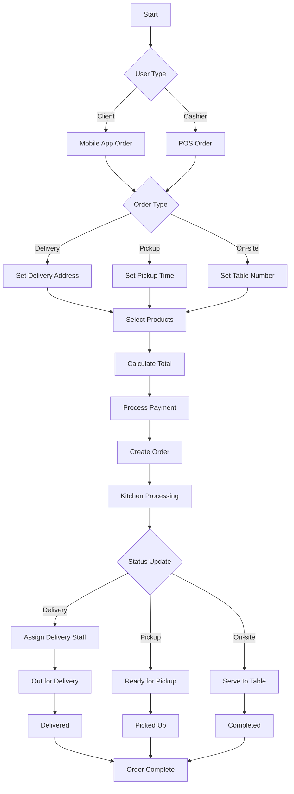
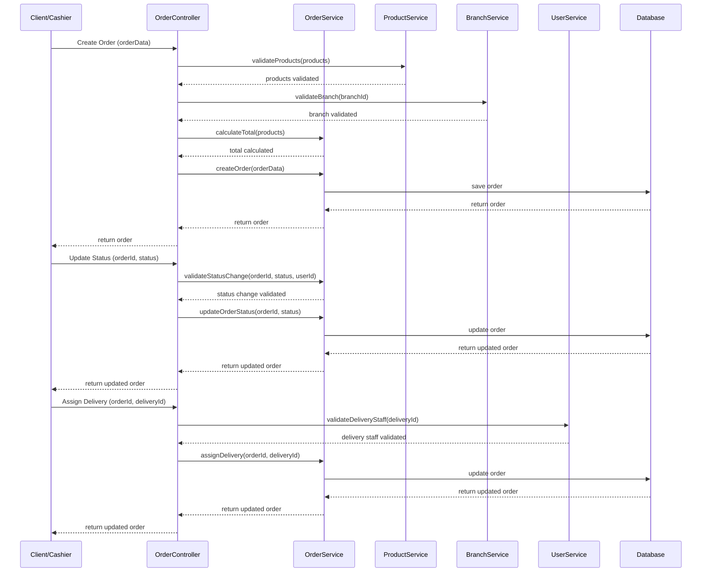

# Order Management Documentation

## Overview
The order management system handles all types of orders (delivery, pickup, and on-site), their processing, and tracking.

## Workflow Diagram



## Sequence Diagram



## NestJS Implementation

### Module Structure
```typescript
// orders.module.ts
@Module({
  imports: [
    ProductsModule,
    BranchesModule,
    UsersModule,
    PaymentsModule,
    NotificationsModule,
  ],
  controllers: [OrdersController],
  providers: [OrdersService],
  exports: [OrdersService],
})
export class OrdersModule {}
```

### Controller
```typescript
// orders.controller.ts
@Controller('orders')
export class OrdersController {
  constructor(
    private readonly ordersService: OrdersService,
    private readonly productsService: ProductsService,
    private readonly branchesService: BranchesService,
    private readonly usersService: UsersService,
    private readonly notificationsService: NotificationsService,
  ) {}

  @Post()
  @UseGuards(JwtAuthGuard)
  async create(@Body() createOrderDto: CreateOrderDto, @Request() req) {
    // Validate products
    for (const item of createOrderDto.items) {
      const product = await this.productsService.findOne(item.productId);
      if (!product) {
        throw new NotFoundException(`Product with ID ${item.productId} not found`);
      }
      
      // Validate product belongs to the branch
      if (product.branchId !== createOrderDto.branchId) {
        throw new BadRequestException(`Product ${product.name} does not belong to the selected branch`);
      }
    }
    
    // Set client ID based on authenticated user for client orders
    // For cashier-created orders, the clientId is specified in DTO
    if (req.user.role === Role.CLIENT) {
      createOrderDto.clientId = req.user.id;
    } else if (req.user.role === Role.CASHIER && !createOrderDto.clientId) {
      // For on-site orders without a registered client
      createOrderDto.clientId = null;
    }
    
    // Create the order
    const order = await this.ordersService.create(createOrderDto);
    
    // Send notification about new order
    await this.notificationsService.sendOrderNotification(
      order.id,
      'New Order Created',
      `Order #${order.orderNumber} has been created and is awaiting processing.`
    );
    
    return order;
  }

  @Patch(':id/status')
  @UseGuards(JwtAuthGuard, RolesGuard)
  @Roles(Role.SUPER_ADMIN, Role.BRANCH_ADMIN, Role.CASHIER, Role.DELIVERY)
  async updateStatus(
    @Param('id') id: string,
    @Body() updateStatusDto: UpdateOrderStatusDto,
    @Request() req
  ) {
    const order = await this.ordersService.findOne(id);
    
    // Validate permissions based on role and status
    if (req.user.role === Role.BRANCH_ADMIN && order.branchId !== req.user.branchId) {
      throw new ForbiddenException('Cannot update order from different branch');
    }
    
    if (req.user.role === Role.CASHIER && order.branchId !== req.user.branchId) {
      throw new ForbiddenException('Cannot update order from different branch');
    }
    
    if (req.user.role === Role.DELIVERY && 
        order.deliveryId !== req.user.id && 
        !['OUT_FOR_DELIVERY', 'DELIVERED'].includes(updateStatusDto.status)) {
      throw new ForbiddenException('Delivery staff can only update delivery-related statuses');
    }
    
    // Update order status
    const updatedOrder = await this.ordersService.updateStatus(id, updateStatusDto.status);
    
    // Send notification about status update
    await this.notificationsService.sendOrderNotification(
      id,
      'Order Status Updated',
      `Order #${order.orderNumber} status has been updated to ${updateStatusDto.status}`
    );
    
    return updatedOrder;
  }

  @Patch(':id/assign-delivery')
  @UseGuards(JwtAuthGuard, RolesGuard)
  @Roles(Role.SUPER_ADMIN, Role.BRANCH_ADMIN, Role.CASHIER)
  async assignDelivery(
    @Param('id') id: string,
    @Body() assignDeliveryDto: AssignDeliveryDto,
    @Request() req
  ) {
    const order = await this.ordersService.findOne(id);
    
    // Validate branch access
    if (req.user.role !== Role.SUPER_ADMIN && order.branchId !== req.user.branchId) {
      throw new ForbiddenException('Cannot assign delivery for order from different branch');
    }
    
    // Validate delivery staff exists and belongs to the same branch
    const deliveryStaff = await this.usersService.findOne(assignDeliveryDto.deliveryId);
    if (!deliveryStaff || deliveryStaff.role !== Role.DELIVERY) {
      throw new BadRequestException('Invalid delivery staff');
    }
    
    // Assign delivery staff to order
    const updatedOrder = await this.ordersService.assignDelivery(id, assignDeliveryDto.deliveryId);
    
    // Send notification to delivery staff
    await this.notificationsService.sendOrderNotification(
      id,
      'Delivery Assignment',
      `You have been assigned to deliver Order #${order.orderNumber}`,
      deliveryStaff.id
    );
    
    return updatedOrder;
  }

  // Other endpoints
}
```

### Service
```typescript
// orders.service.ts
@Injectable()
export class OrdersService {
  constructor(
    private prisma: PrismaService,
    private productsService: ProductsService,
  ) {}

  async create(createOrderDto: CreateOrderDto): Promise<Order> {
    // Generate unique order number
    const orderNumber = `ORD-${Date.now()}-${Math.floor(Math.random() * 1000)}`;
    
    // Calculate total price
    let totalPrice = 0;
    const orderItems = [];
    
    for (const item of createOrderDto.items) {
      const product = await this.productsService.findOne(item.productId);
      let itemPrice = product.price;
      
      // Add specification prices
      if (item.specifications && item.specifications.length > 0) {
        for (const specId of item.specifications) {
          const spec = product.specifications.find(s => s.id === specId);
          if (spec && spec.price) {
            itemPrice += spec.price;
          }
        }
      }
      
      // Multiply by quantity
      itemPrice *= item.quantity;
      totalPrice += itemPrice;
      
      // Add to order items
      orderItems.push({
        productId: item.productId,
        quantity: item.quantity,
        price: itemPrice,
        specifications: item.specifications || [],
      });
    }
    
    // Create order with items
    return this.prisma.order.create({
      data: {
        orderNumber,
        type: createOrderDto.type,
        status: OrderStatus.PENDING,
        totalPrice,
        client: createOrderDto.clientId ? { 
          connect: { id: createOrderDto.clientId } 
        } : undefined,
        branch: {
          connect: { id: createOrderDto.branchId }
        },
        location: createOrderDto.location,
        tableNumber: createOrderDto.tableNumber,
        items: {
          create: orderItems,
        },
      },
      include: {
        items: {
          include: {
            product: true,
          },
        },
        client: true,
        branch: true,
        delivery: true,
      },
    });
  }

  async findOne(id: string): Promise<Order> {
    return this.prisma.order.findUnique({
      where: { id },
      include: {
        items: {
          include: {
            product: true,
          },
        },
        client: true,
        branch: true,
        delivery: true,
      },
    });
  }

  async updateStatus(id: string, status: OrderStatus): Promise<Order> {
    return this.prisma.order.update({
      where: { id },
      data: { status },
      include: {
        items: {
          include: {
            product: true,
          },
        },
        client: true,
        branch: true,
        delivery: true,
      },
    });
  }

  async assignDelivery(orderId: string, deliveryId: string): Promise<Order> {
    return this.prisma.order.update({
      where: { id: orderId },
      data: {
        delivery: {
          connect: { id: deliveryId }
        },
      },
      include: {
        items: {
          include: {
            product: true,
          },
        },
        client: true,
        branch: true,
        delivery: true,
      },
    });
  }

  // Other methods
}
```

## Database Schema (Prisma)

```prisma
model Order {
  id          String      @id @default(auto()) @map("_id") @db.ObjectId
  orderNumber String      @unique
  type        OrderType
  status      OrderStatus
  items       OrderItem[]
  totalPrice  Float
  
  // Client Information
  clientId    String?     @db.ObjectId
  client      User?       @relation("ClientOrders", fields: [clientId], references: [id])
  
  // Branch Information
  branchId    String      @db.ObjectId
  branch      Branch      @relation(fields: [branchId], references: [id])
  
  // Delivery Information
  deliveryId  String?     @db.ObjectId
  delivery    User?       @relation("DeliveryOrders", fields: [deliveryId], references: [id])
  location    Json?       // For delivery orders - {latitude, longitude, address}
  
  // On-site Information
  tableNumber Int?        // For on-site orders
  
  // Related records
  payment     Payment?
  invoice     Invoice?
  
  // Timestamps
  createdAt   DateTime    @default(now())
  updatedAt   DateTime    @updatedAt
}

model OrderItem {
  id              String     @id @default(auto()) @map("_id") @db.ObjectId
  orderId         String     @db.ObjectId
  order           Order      @relation(fields: [orderId], references: [id])
  productId       String     @db.ObjectId
  product         Product    @relation(fields: [productId], references: [id])
  quantity        Int
  price           Float      // Total price for this item
  specifications  String[]   @db.ObjectId // Array of specification IDs
}

enum OrderType {
  DELIVERY
  PICKUP
  ONSITE
}

enum OrderStatus {
  PENDING
  CONFIRMED
  PREPARING
  READY_FOR_PICKUP
  OUT_FOR_DELIVERY
  DELIVERED
  COMPLETED
  CANCELLED
}
```

## Integration Points

### Orders → Users
- Clients place orders
- Delivery staff are assigned to orders
- Cashiers manage orders

### Orders → Products
- Products with specifications are added to orders
- Product prices affect order total

### Orders → Branches
- Orders are associated with specific branches
- Branch analytics are derived from orders

### Orders → Payments
- Orders trigger payment processing
- Payment status affects order workflow

### Orders → Invoices
- Completed orders generate invoices
- Invoices reference order details

### Orders → Notifications
- Order status changes trigger notifications
- Delivery assignments trigger notifications

## Testing Strategy

### Unit Tests
```typescript
// orders.service.spec.ts
describe('OrdersService', () => {
  let service: OrdersService;
  let prisma: PrismaService;
  let productsService: ProductsService;
  
  beforeEach(async () => {
    const module = await Test.createTestingModule({
      providers: [
        OrdersService,
        {
          provide: PrismaService,
          useValue: {
            order: {
              create: jest.fn(),
              findUnique: jest.fn(),
              findMany: jest.fn(),
              update: jest.fn(),
              delete: jest.fn(),
            },
          },
        },
        {
          provide: ProductsService,
          useValue: {
            findOne: jest.fn(),
          },
        },
      ],
    }).compile();
    
    service = module.get<OrdersService>(OrdersService);
    prisma = module.get<PrismaService>(PrismaService);
    productsService = module.get<ProductsService>(ProductsService);
  });
  
  it('should create an order with correct total price', async () => {
    // Test implementation
  });
  
  it('should update order status', async () => {
    // Test implementation
  });
  
  it('should assign delivery staff to order', async () => {
    // Test implementation
  });
});
```

### E2E Tests
```typescript
// orders.e2e-spec.ts
describe('Orders (e2e)', () => {
  let app: INestApplication;
  let authToken: string;
  let branchId: string;
  
  beforeEach(async () => {
    const moduleFixture = await Test.createTestingModule({
      imports: [AppModule],
    }).compile();
    
    app = moduleFixture.createNestApplication();
    await app.init();
    
    // Get auth token and branch ID for tests
    // ...login and setup logic
  });
  
  it('/orders (POST) - should create a new order', () => {
    // Test implementation with auth token
  });
  
  it('/orders/:id/status (PATCH) - should update order status', () => {
    // Test implementation with auth token
  });
});
``` 