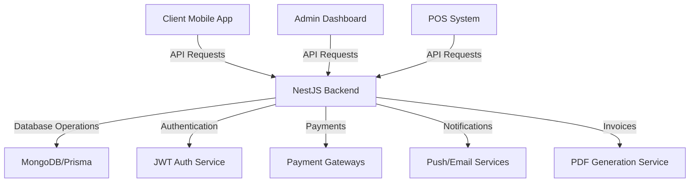
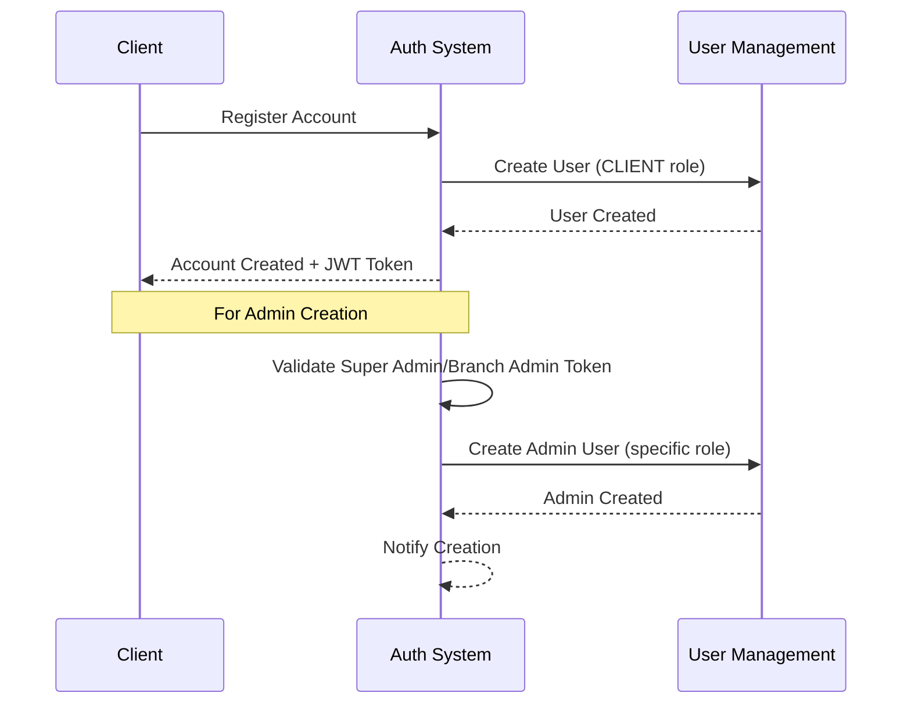
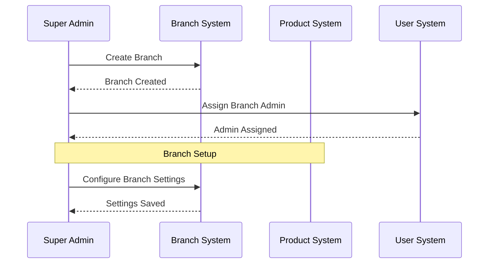
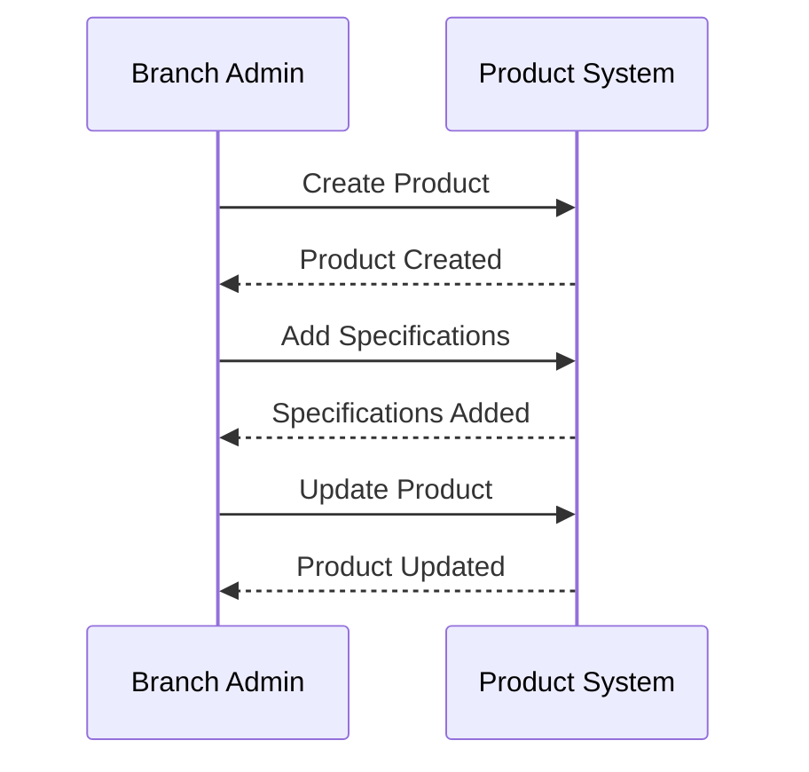
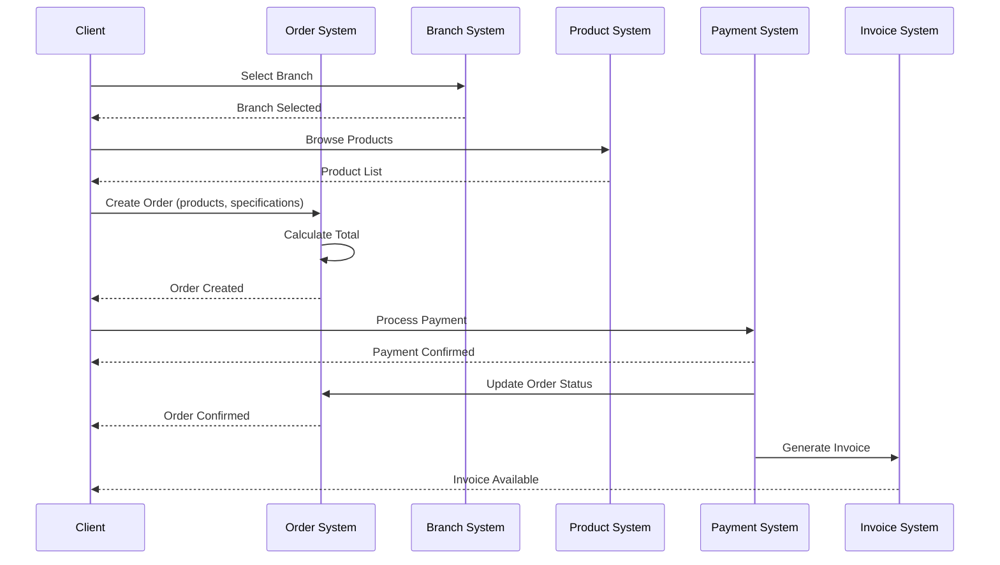
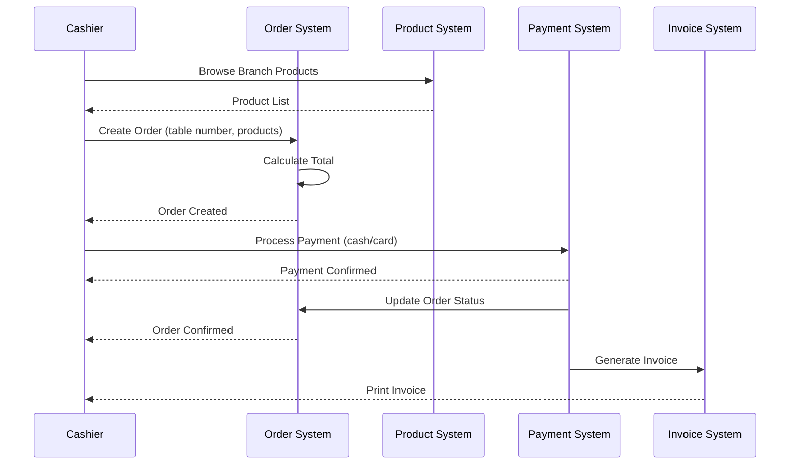
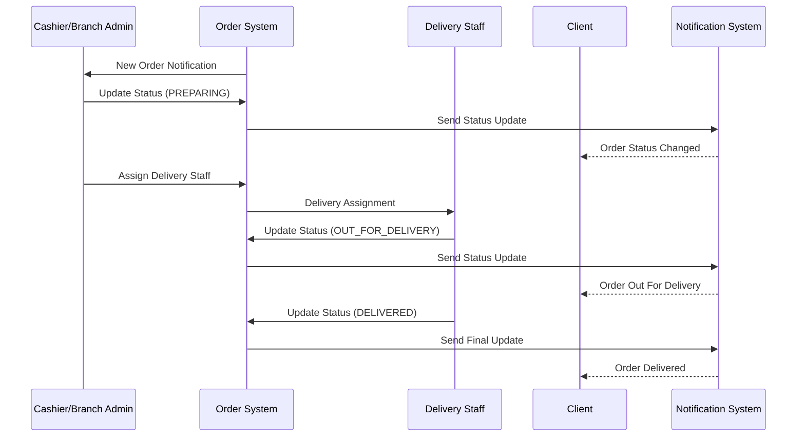
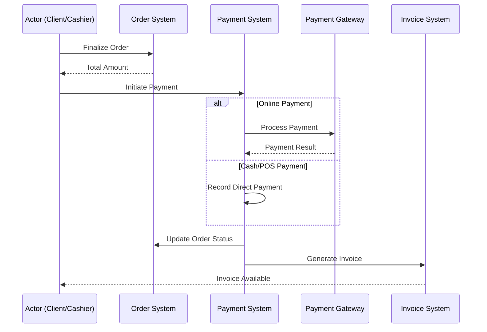
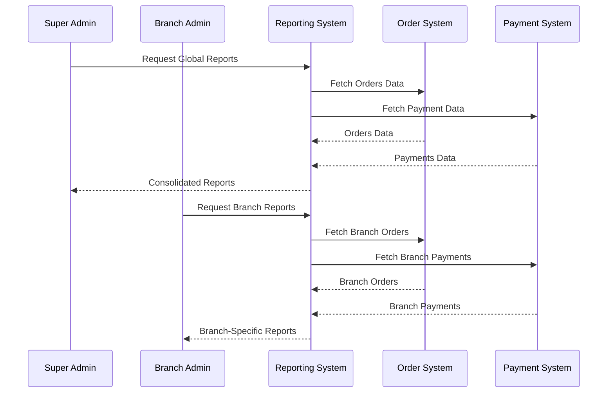

# Restaurant Management System Overview

## Project Overview

This restaurant management system is a comprehensive platform designed to streamline restaurant operations across multiple branches with a focus on order management, delivery tracking, and consolidated reporting. The system supports both mobile app ordering for clients and in-restaurant POS functionality for staff.

The platform uses a modern tech stack:
- **Backend**: NestJS with TypeScript
- **Database**: MongoDB with Prisma ORM
- **Mobile App**: React Native for client-facing applications
- **Integration**: External payment gateways, location services, and email delivery systems

## System Architecture

## Key Actors & Roles

### 1. Super Admin
The restaurant chain owner with complete system access:
- Manages all branches
- Creates branch admins
- Accesses company-wide analytics and reports
- Configures global settings

### 2. Branch Admin
Manages operations for a specific restaurant location:
- Creates and manages menu products for their branch
- Manages branch staff (cashiers and delivery personnel)
- Views branch-specific analytics
- Handles branch-level operational settings

### 3. Cashier
Handles in-restaurant operations:
- Processes on-site orders at POS
- Handles pickup orders
- Manages payments (cash, card, etc.)
- Assigns orders to delivery staff
- Generates and prints invoices

### 4. Delivery Staff
Handles order delivery:
- Views assigned delivery orders
- Updates delivery status
- Marks orders as delivered
- Tracks delivery performance

### 5. Client
End users who place orders:
- Browses restaurant menu
- Places delivery/pickup orders
- Tracks order status
- Makes online payments
- Views order history and invoices

## Core Use Cases & Workflows

### User Registration & Authentication

**Actor**: Client or Admin (for staff creation)
- Clients self-register through the mobile app
- Admin users are created by higher-level admins
- System validates credentials and generates JWT tokens
- Tokens include role-based permissions
- Protected routes verify permissions for each request

### Branch Management

**Actor**: Super Admin
- Creates restaurant branches with location info
- Assigns branch admins to manage operations
- Configures branch-specific settings
- Views analytics across all branches
- The branch serves as an organizational unit connecting products, staff, and orders

### Product Management

**Actor**: Branch Admin
- Creates menu items for their specific branch
- Configures product specifications (e.g., size, toppings)
- Sets pricing for products and specifications
- Organizes products by categories
- These products become available in the branch menu for ordering

### Order Placement - Mobile Client

**Actor**: Client
- Selects a restaurant branch
- Browses branch-specific menu
- Adds products with specifications to cart
- Provides delivery address or selects pickup
- Makes payment through the integrated payment gateway
- Receives order confirmation and tracking
- Gets PDF invoice via email and in-app

### Order Placement - In-Restaurant POS

**Actor**: Cashier
- Takes customer orders at the restaurant
- Assigns table numbers for dine-in
- Processes payments (cash, card terminal)
- Prints physical receipts/invoices
- Manages on-site order flow
- This creates unified order records in the system alongside mobile orders

### Order Processing & Delivery

**Actor**: Cashier, Branch Admin, Delivery Staff
- Branch staff receives orders and updates status
- For delivery orders, staff assigns delivery personnel
- Delivery staff updates status during delivery process
- Client receives real-time status updates via notifications
- System maintains a complete order lifecycle record

### Payment Processing

**Actor**: Client (for online) or Cashier (for POS)
- System handles multiple payment methods
- Online payments go through payment gateways
- POS payments are recorded directly
- All payments are tracked uniformly regardless of method
- Successful payments trigger order confirmation and invoice generation

### Reporting & Analytics

**Actor**: Super Admin, Branch Admin
- Super admin accesses company-wide analytics
- Branch admins view branch-specific performance
- System generates reports based on orders and payments
- Analytics include sales trends, popular products, delivery metrics
- Data can be filtered by date ranges, product categories, order types

## System Integration Points

### Authentication → All Features
- JWT tokens secure all API endpoints
- Role-based permissions control access to features
- User context is maintained across all operations

### Branches → Products & Staff
- Branches contain branch-specific products
- Staff members are assigned to specific branches
- Branch structure provides organizational hierarchy

### Products → Orders
- Products with specifications are added to orders
- Product availability and pricing affect order creation
- Product performance metrics feed into analytics

### Orders → Payments → Invoices
- Orders trigger payment processing
- Successful payments update order status
- Completed transactions generate invoices
- The order lifecycle connects all operational components

### Notifications System
- Order status changes trigger customer notifications
- Delivery assignments alert delivery staff
- System notifications inform admins of important events
- Notifications keep all parties informed throughout workflows

## Technology Implementation

The system uses a modular architecture with the following key components:

1. **NestJS Backend**
   - RESTful API endpoints for all features
   - JWT authentication and role-based guards
   - Service-oriented architecture for business logic
   - Integration with external services

2. **Prisma ORM with MongoDB**
   - Structured data models with relationships
   - Efficient querying and data manipulation
   - Type-safe database operations

3. **Mobile Client Application**
   - React Native for cross-platform support
   - Real-time order tracking
   - Integrated payment processing
   - Push notification support

4. **Admin Dashboard**
   - Branch management interface
   - Staff administration tools
   - Product catalog management
   - Analytics and reporting interfaces

## Conclusion

This restaurant management system provides a comprehensive solution for multi-branch restaurant operations, connecting clients, staff, orders, and analytics in a unified platform. The system's modular design allows for scalability and future feature additions while maintaining a consistent user experience across all touchpoints.

The role-based permissions ensure that each user type has access to exactly the features they need, while the integrated workflows ensure smooth operations from order placement to delivery and reporting. 