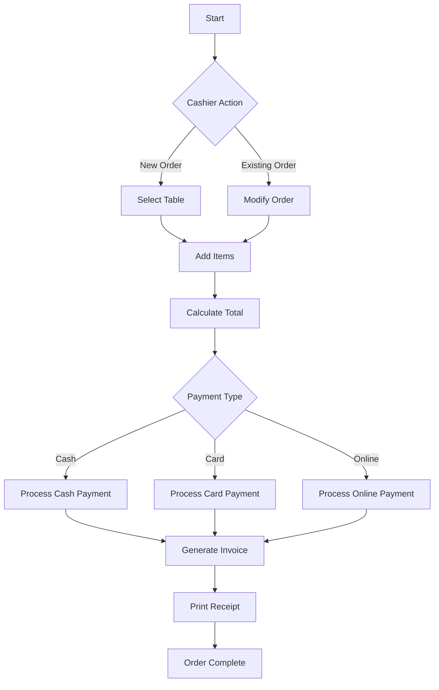
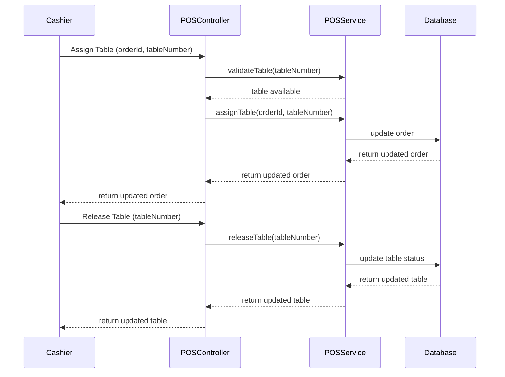

# POS Operations and On-site Order Management

## Overview
This document outlines the Point of Sale (POS) system features for managing on-site orders, table assignments, and in-house customer orders.

## Workflow Diagram



## Table Management



## Database Schema (Prisma)

```prisma
model Table {
  id          String    @id @default(auto()) @map("_id") @db.ObjectId
  number      Int       @unique
  capacity    Int
  status      TableStatus
  branchId    String    @db.ObjectId
  branch      Branch    @relation(fields: [branchId], references: [id])
  currentOrder String?  @db.ObjectId
  createdAt   DateTime  @default(now())
  updatedAt   DateTime  @updatedAt
}

model Order {
  id            String      @id @default(auto()) @map("_id") @db.ObjectId
  orderNumber   String      @unique
  type          OrderType
  status        OrderStatus
  tableNumber   Int?
  table         Table?      @relation(fields: [tableNumber], references: [number])
  branchId      String      @db.ObjectId
  branch        Branch      @relation(fields: [branchId], references: [id])
  items         OrderItem[]
  total         Float
  payment       Payment?
  createdAt     DateTime    @default(now())
  updatedAt     DateTime    @updatedAt
}

enum TableStatus {
  AVAILABLE
  OCCUPIED
  RESERVED
  MAINTENANCE
}

enum OrderType {
  DELIVERY
  PICKUP
  ON_SITE
}
```

## Implementation Details

### POS Service
```typescript
// pos.service.ts
@Injectable()
export class POSService {
  constructor(
    private prisma: PrismaService,
    private orderService: OrderService,
    private paymentService: PaymentService,
  ) {}

  async createOnSiteOrder(
    createOrderDto: CreateOrderDto,
    cashierId: string
  ): Promise<Order> {
    // Validate table availability
    if (createOrderDto.tableNumber) {
      const table = await this.prisma.table.findUnique({
        where: { number: createOrderDto.tableNumber },
      });
      
      if (table.status !== TableStatus.AVAILABLE) {
        throw new BadRequestException('Table is not available');
      }
    }

    // Create order
    const order = await this.orderService.create({
      ...createOrderDto,
      type: OrderType.ON_SITE,
      createdBy: cashierId,
    });

    // Update table status if assigned
    if (createOrderDto.tableNumber) {
      await this.prisma.table.update({
        where: { number: createOrderDto.tableNumber },
        data: {
          status: TableStatus.OCCUPIED,
          currentOrder: order.id,
        },
      });
    }

    return order;
  }

  async processPayment(
    orderId: string,
    paymentData: ProcessPaymentDto,
    cashierId: string
  ): Promise<Payment> {
    const order = await this.orderService.findOne(orderId);
    
    // Process payment
    const payment = await this.paymentService.processPayment({
      orderId,
      amount: order.total,
      method: paymentData.method,
      processedBy: cashierId,
    });

    // Generate and print invoice
    await this.generateAndPrintInvoice(orderId);

    return payment;
  }

  async modifyOrder(
    orderId: string,
    updateOrderDto: UpdateOrderDto,
    cashierId: string
  ): Promise<Order> {
    const order = await this.orderService.findOne(orderId);
    
    // Validate modification permissions
    if (order.status === OrderStatus.COMPLETED) {
      throw new BadRequestException('Cannot modify completed order');
    }

    return this.orderService.update(orderId, updateOrderDto);
  }
}
```

### Table Management Service
```typescript
// table.service.ts
@Injectable()
export class TableService {
  constructor(private prisma: PrismaService) {}

  async assignTable(orderId: string, tableNumber: number): Promise<Table> {
    const table = await this.prisma.table.findUnique({
      where: { number: tableNumber },
    });

    if (table.status !== TableStatus.AVAILABLE) {
      throw new BadRequestException('Table is not available');
    }

    return this.prisma.table.update({
      where: { number: tableNumber },
      data: {
        status: TableStatus.OCCUPIED,
        currentOrder: orderId,
      },
    });
  }

  async releaseTable(tableNumber: number): Promise<Table> {
    return this.prisma.table.update({
      where: { number: tableNumber },
      data: {
        status: TableStatus.AVAILABLE,
        currentOrder: null,
      },
    });
  }
}
```

## Testing Strategy

### Unit Tests
```typescript
// pos.service.spec.ts
describe('POSService', () => {
  let service: POSService;
  let prisma: PrismaService;
  let orderService: OrderService;
  let paymentService: PaymentService;

  beforeEach(async () => {
    const module = await Test.createTestingModule({
      providers: [
        POSService,
        {
          provide: PrismaService,
          useValue: {
            table: {
              findUnique: jest.fn(),
              update: jest.fn(),
            },
          },
        },
        {
          provide: OrderService,
          useValue: {
            create: jest.fn(),
            findOne: jest.fn(),
            update: jest.fn(),
          },
        },
        {
          provide: PaymentService,
          useValue: {
            processPayment: jest.fn(),
          },
        },
      ],
    }).compile();

    service = module.get<POSService>(POSService);
    prisma = module.get<PrismaService>(PrismaService);
    orderService = module.get<OrderService>(OrderService);
    paymentService = module.get<PaymentService>(PaymentService);
  });

  it('should create on-site order with table assignment', async () => {
    // Test implementation
  });

  it('should process payment and generate invoice', async () => {
    // Test implementation
  });

  it('should modify existing order', async () => {
    // Test implementation
  });
});
```

### E2E Tests
```typescript
// pos.e2e-spec.ts
describe('POS Operations (e2e)', () => {
  let app: INestApplication;

  beforeEach(async () => {
    const moduleFixture = await Test.createTestingModule({
      imports: [AppModule],
    }).compile();

    app = moduleFixture.createNestApplication();
    await app.init();
  });

  it('/pos/orders (POST) - should create on-site order', () => {
    // Test implementation
  });

  it('/pos/orders/:id/payment (POST) - should process payment', () => {
    // Test implementation
  });

  it('/pos/tables/:number (PATCH) - should assign table', () => {
    // Test implementation
  });
});
``` 