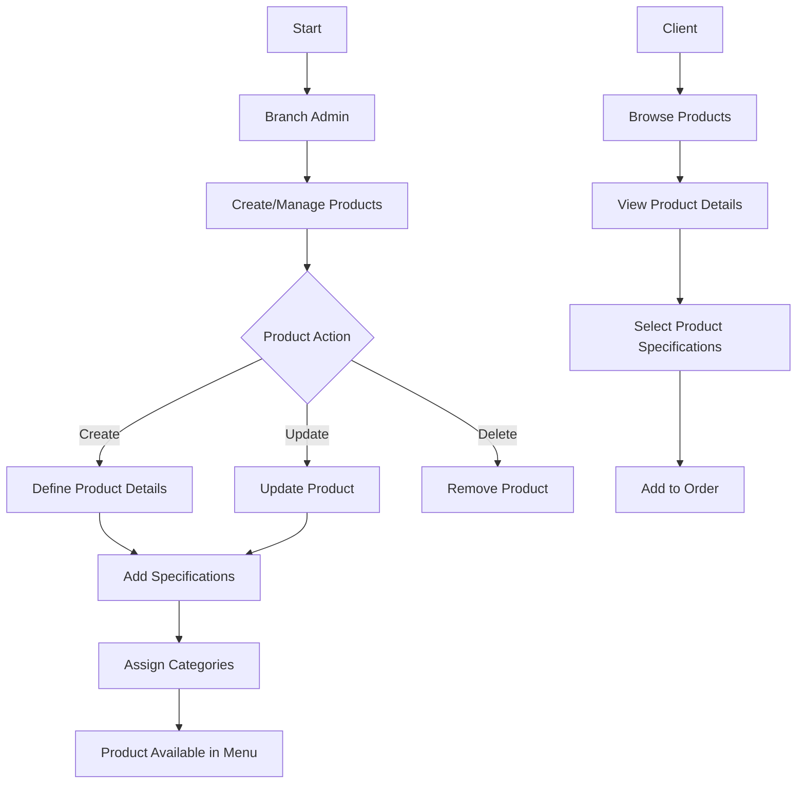
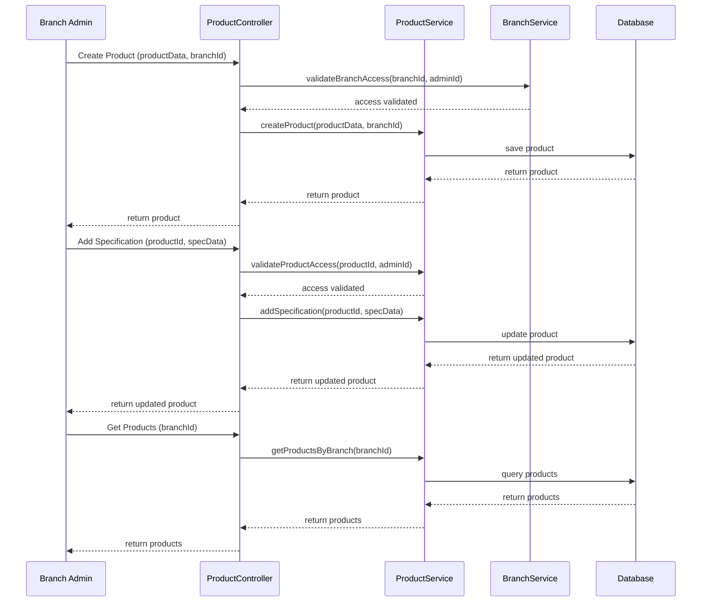

# Product Management Documentation

## Overview
The product management system handles menu items, pricing, and specifications across different branches.

## Workflow Diagram



## Sequence Diagram



## NestJS Implementation

### Module Structure
```typescript
// products.module.ts
@Module({
  imports: [BranchesModule],
  controllers: [ProductsController],
  providers: [ProductsService],
  exports: [ProductsService],
})
export class ProductsModule {}
```

### Controller
```typescript
// products.controller.ts
@Controller('products')
export class ProductsController {
  constructor(
    private readonly productsService: ProductsService,
    private readonly branchesService: BranchesService,
  ) {}

  @Post()
  @UseGuards(JwtAuthGuard, RolesGuard)
  @Roles(Role.SUPER_ADMIN, Role.BRANCH_ADMIN)
  async create(
    @Body() createProductDto: CreateProductDto,
    @Request() req
  ) {
    if (req.user.role === Role.BRANCH_ADMIN && 
        createProductDto.branchId !== req.user.branchId) {
      throw new ForbiddenException('Cannot create product for different branch');
    }
    
    // Validate branch exists
    await this.branchesService.findById(createProductDto.branchId);
    
    return this.productsService.create(createProductDto);
  }

  @Post(':id/specifications')
  @UseGuards(JwtAuthGuard, RolesGuard)
  @Roles(Role.SUPER_ADMIN, Role.BRANCH_ADMIN)
  async addSpecification(
    @Param('id') id: string,
    @Body() specificationDto: SpecificationDto,
    @Request() req
  ) {
    const product = await this.productsService.findOne(id);
    
    if (req.user.role === Role.BRANCH_ADMIN && 
        product.branchId !== req.user.branchId) {
      throw new ForbiddenException('Cannot modify product from different branch');
    }
    
    return this.productsService.addSpecification(id, specificationDto);
  }

  @Get('branch/:branchId')
  async findByBranch(@Param('branchId') branchId: string) {
    return this.productsService.findByBranch(branchId);
  }

  // Other endpoints
}
```

### Service
```typescript
// products.service.ts
@Injectable()
export class ProductsService {
  constructor(private prisma: PrismaService) {}

  async create(createProductDto: CreateProductDto): Promise<Product> {
    return this.prisma.product.create({
      data: {
        name: createProductDto.name,
        price: createProductDto.price,
        description: createProductDto.description,
        branch: {
          connect: { id: createProductDto.branchId }
        },
        specifications: {
          create: createProductDto.specifications || [],
        }
      },
    });
  }

  async findOne(id: string): Promise<Product> {
    return this.prisma.product.findUnique({
      where: { id },
      include: {
        specifications: true,
      },
    });
  }

  async findByBranch(branchId: string): Promise<Product[]> {
    return this.prisma.product.findMany({
      where: { branchId },
      include: {
        specifications: true,
      },
    });
  }

  async addSpecification(
    productId: string, 
    specificationDto: SpecificationDto
  ): Promise<Product> {
    return this.prisma.product.update({
      where: { id: productId },
      data: {
        specifications: {
          create: {
            name: specificationDto.name,
            price: specificationDto.price,
          }
        }
      },
      include: {
        specifications: true,
      },
    });
  }

  // Other methods
}
```

## Database Schema (Prisma)

```prisma
model Product {
  id             String         @id @default(auto()) @map("_id") @db.ObjectId
  name           String
  price          Float
  description    String?
  specifications Specification[]
  branchId       String         @db.ObjectId
  branch         Branch         @relation(fields: [branchId], references: [id])
  orderItems     OrderItem[]
  createdAt      DateTime       @default(now())
  updatedAt      DateTime       @updatedAt
}

model Specification {
  id        String   @id @default(auto()) @map("_id") @db.ObjectId
  name      String
  price     Float?   // Optional additional cost
  productId String   @db.ObjectId
  product   Product  @relation(fields: [productId], references: [id])
}
```

## Integration Points

### Products → Branches
- Products are associated with specific branches
- Branch admins manage products for their branch

### Products → Orders
- Products are added to orders
- Specifications are selected during order creation

## Testing Strategy

### Unit Tests
```typescript
// products.service.spec.ts
describe('ProductsService', () => {
  let service: ProductsService;
  let prisma: PrismaService;
  
  beforeEach(async () => {
    const module = await Test.createTestingModule({
      providers: [
        ProductsService,
        {
          provide: PrismaService,
          useValue: {
            product: {
              create: jest.fn(),
              findUnique: jest.fn(),
              findMany: jest.fn(),
              update: jest.fn(),
              delete: jest.fn(),
            },
          },
        },
      ],
    }).compile();
    
    service = module.get<ProductsService>(ProductsService);
    prisma = module.get<PrismaService>(PrismaService);
  });
  
  it('should create a product with specifications', async () => {
    // Test implementation
  });
  
  it('should find products by branch', async () => {
    // Test implementation
  });
});
```

### E2E Tests
```typescript
// products.e2e-spec.ts
describe('Products (e2e)', () => {
  let app: INestApplication;
  let authToken: string;
  let branchId: string;
  
  beforeEach(async () => {
    const moduleFixture = await Test.createTestingModule({
      imports: [AppModule],
    }).compile();
    
    app = moduleFixture.createNestApplication();
    await app.init();
    
    // Get auth token and branch ID for tests
    // ...login and setup logic
  });
  
  it('/products (POST) - should create a new product', () => {
    // Test implementation with auth token
  });
  
  it('/products/branch/:branchId (GET) - should return branch products', () => {
    // Test implementation
  });
});
``` 