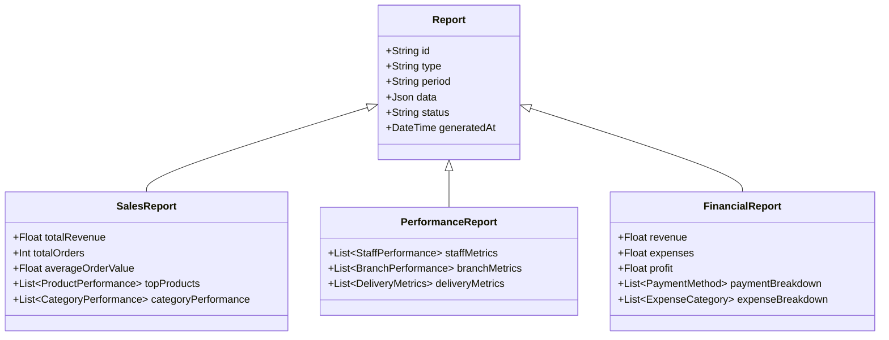

# Reporting System

## Overview
This document outlines the reporting system, including sales analytics, performance metrics, and financial reporting.

## Report Structure



## Database Schema (Prisma)

```prisma
model Report {
  id          String   @id @default(auto()) @map("_id") @db.ObjectId
  type        ReportType
  period      String
  data        Json
  status      String   @default("PENDING")
  generatedAt DateTime @default(now())
  createdAt   DateTime @default(now())
  updatedAt   DateTime @updatedAt
}

model SalesReport {
  id                String   @id @default(auto()) @map("_id") @db.ObjectId
  totalRevenue      Float
  totalOrders       Int
  averageOrderValue Float
  topProducts       Json
  categoryPerformance Json
  reportId          String   @unique @db.ObjectId
  report            Report   @relation(fields: [reportId], references: [id])
  createdAt         DateTime @default(now())
  updatedAt         DateTime @updatedAt
}

model PerformanceReport {
  id             String   @id @default(auto()) @map("_id") @db.ObjectId
  staffMetrics   Json
  branchMetrics  Json
  deliveryMetrics Json
  reportId       String   @unique @db.ObjectId
  report         Report   @relation(fields: [reportId], references: [id])
  createdAt      DateTime @default(now())
  updatedAt      DateTime @updatedAt
}

model FinancialReport {
  id              String   @id @default(auto()) @map("_id") @db.ObjectId
  revenue         Float
  expenses        Float
  profit          Float
  paymentBreakdown Json
  expenseBreakdown Json
  reportId        String   @unique @db.ObjectId
  report          Report   @relation(fields: [reportId], references: [id])
  createdAt       DateTime @default(now())
  updatedAt       DateTime @updatedAt
}

enum ReportType {
  SALES
  PERFORMANCE
  FINANCIAL
  CUSTOM
}
```

## Implementation Details

### Reporting Service
```typescript
@Injectable()
export class ReportingService {
  constructor(
    private prisma: PrismaService,
    private orderService: OrderService,
    private staffService: StaffService,
    private financeService: FinanceService,
  ) {}

  async generateSalesReport(
    startDate: Date,
    endDate: Date,
    branchId?: string
  ): Promise<SalesReport> {
    const orders = await this.orderService.getOrdersByDateRange(
      startDate,
      endDate,
      branchId
    );

    const report = await this.prisma.report.create({
      data: {
        type: ReportType.SALES,
        period: `${startDate.toISOString()} - ${endDate.toISOString()}`,
        status: 'GENERATING',
      },
    });

    const salesData = this.processSalesData(orders);

    return this.prisma.salesReport.create({
      data: {
        ...salesData,
        reportId: report.id,
      },
    });
  }

  async generatePerformanceReport(
    startDate: Date,
    endDate: Date
  ): Promise<PerformanceReport> {
    const staffMetrics = await this.staffService.getPerformanceMetrics(
      startDate,
      endDate
    );

    const report = await this.prisma.report.create({
      data: {
        type: ReportType.PERFORMANCE,
        period: `${startDate.toISOString()} - ${endDate.toISOString()}`,
        status: 'GENERATING',
      },
    });

    return this.prisma.performanceReport.create({
      data: {
        staffMetrics,
        branchMetrics: await this.calculateBranchMetrics(startDate, endDate),
        deliveryMetrics: await this.calculateDeliveryMetrics(startDate, endDate),
        reportId: report.id,
      },
    });
  }

  async generateFinancialReport(
    startDate: Date,
    endDate: Date
  ): Promise<FinancialReport> {
    const financialData = await this.financeService.getFinancialData(
      startDate,
      endDate
    );

    const report = await this.prisma.report.create({
      data: {
        type: ReportType.FINANCIAL,
        period: `${startDate.toISOString()} - ${endDate.toISOString()}`,
        status: 'GENERATING',
      },
    });

    return this.prisma.financialReport.create({
      data: {
        ...financialData,
        reportId: report.id,
      },
    });
  }

  private processSalesData(orders: Order[]): any {
    // Implementation for processing sales data
    return {
      totalRevenue: orders.reduce((sum, order) => sum + order.total, 0),
      totalOrders: orders.length,
      averageOrderValue: orders.reduce((sum, order) => sum + order.total, 0) / orders.length,
      // Additional processing...
    };
  }
}
```

## Business Rules
1. Reports generated daily, weekly, and monthly
2. Data must be accurate and up-to-date
3. Reports can be filtered by branch
4. Performance metrics updated in real-time
5. Financial reports require approval
6. Custom reports can be created
7. Report access based on user role

## Error Handling
1. Data processing errors
2. Report generation failures
3. Database connectivity issues
4. Invalid date ranges
5. Authorization failures

## Testing Strategy
1. Unit tests for data processing
2. Integration tests for report generation
3. E2E tests for report delivery
4. Performance tests for large datasets
5. Validation tests for business rules 