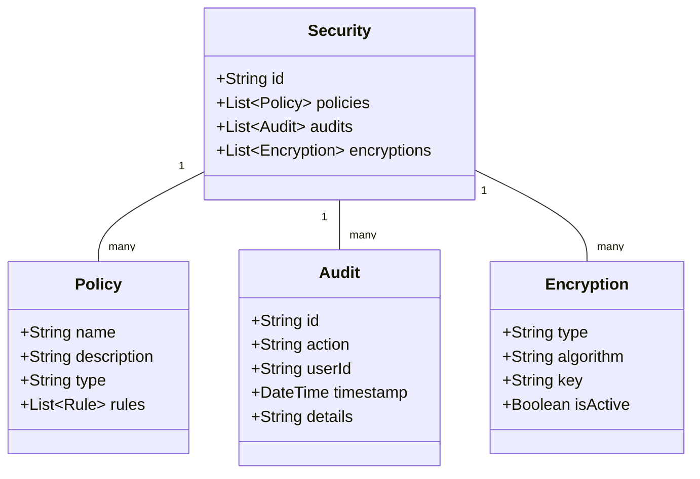

# Security and Compliance System

## Overview
This document outlines the security measures, data protection, and compliance requirements for the restaurant management system.

## Security Structure



## Database Schema (Prisma)

```prisma
model Security {
  id          String      @id @default(auto()) @map("_id") @db.ObjectId
  policies    Policy[]
  audits      Audit[]
  encryptions Encryption[]
  createdAt   DateTime    @default(now())
  updatedAt   DateTime    @updatedAt
}

model Policy {
  id          String    @id @default(auto()) @map("_id") @db.ObjectId
  name        String
  description String?
  type        PolicyType
  rules       Json
  securityId  String    @db.ObjectId
  security    Security  @relation(fields: [securityId], references: [id])
  createdAt   DateTime  @default(now())
  updatedAt   DateTime  @updatedAt
}

model Audit {
  id        String    @id @default(auto()) @map("_id") @db.ObjectId
  action    String
  userId    String    @db.ObjectId
  timestamp DateTime  @default(now())
  details   Json
  securityId String   @db.ObjectId
  security   Security @relation(fields: [securityId], references: [id])
  createdAt  DateTime @default(now())
  updatedAt  DateTime @updatedAt
}

model Encryption {
  id        String    @id @default(auto()) @map("_id") @db.ObjectId
  type      String
  algorithm String
  key       String
  isActive  Boolean   @default(true)
  securityId String   @db.ObjectId
  security   Security @relation(fields: [securityId], references: [id])
  createdAt  DateTime @default(now())
  updatedAt  DateTime @updatedAt
}

enum PolicyType {
  ACCESS_CONTROL
  DATA_PROTECTION
  PAYMENT_SECURITY
  AUDIT_LOGGING
  COMPLIANCE
}
```

## Implementation Details

### Security Service
```typescript
@Injectable()
export class SecurityService {
  constructor(
    private prisma: PrismaService,
    private encryptionService: EncryptionService,
    private auditService: AuditService,
  ) {}

  async initializeSecurity(): Promise<Security> {
    const security = await this.prisma.security.create({
      data: {
        policies: {
          create: [
            {
              name: 'Access Control',
              type: PolicyType.ACCESS_CONTROL,
              rules: {
                roleBasedAccess: true,
                minimumPasswordLength: 8,
                passwordExpiryDays: 90,
              },
            },
            {
              name: 'Data Protection',
              type: PolicyType.DATA_PROTECTION,
              rules: {
                encryptionRequired: true,
                dataRetentionDays: 365,
                backupFrequency: 'daily',
              },
            },
            // Additional policies...
          ],
        },
        encryptions: {
          create: [
            {
              type: 'AES',
              algorithm: 'AES-256-GCM',
              key: process.env.ENCRYPTION_KEY,
              isActive: true,
            },
          ],
        },
      },
    });

    return security;
  }

  async logAudit(
    userId: string,
    action: string,
    details: any
  ): Promise<Audit> {
    return this.prisma.audit.create({
      data: {
        userId,
        action,
        details,
        security: {
          connect: {
            id: await this.getSecurityId(),
          },
        },
      },
    });
  }

  async encryptData(data: string): Promise<string> {
    const encryption = await this.prisma.encryption.findFirst({
      where: { isActive: true },
    });

    return this.encryptionService.encrypt(data, encryption.key);
  }

  async decryptData(encryptedData: string): Promise<string> {
    const encryption = await this.prisma.encryption.findFirst({
      where: { isActive: true },
    });

    return this.encryptionService.decrypt(encryptedData, encryption.key);
  }

  async generateSecurityReport(
    startDate: Date,
    endDate: Date
  ): Promise<SecurityReport> {
    const audits = await this.prisma.audit.findMany({
      where: {
        timestamp: {
          gte: startDate,
          lte: endDate,
        },
      },
    });

    return this.processSecurityReport(audits);
  }
}
```

## Business Rules
1. All sensitive data must be encrypted
2. Access control based on user roles
3. Regular security audits required
4. Password policies enforced
5. Data retention policies followed
6. Payment data PCI compliant
7. Regular security updates

## Error Handling
1. Encryption failures
2. Access control violations
3. Audit logging errors
4. Policy enforcement failures
5. Compliance violations

## Testing Strategy
1. Unit tests for encryption
2. Integration tests for policies
3. Security penetration tests
4. Compliance verification tests
5. Audit logging tests

## Compliance Requirements
1. GDPR compliance
2. PCI DSS compliance
3. Data protection laws
4. Industry standards
5. Local regulations 