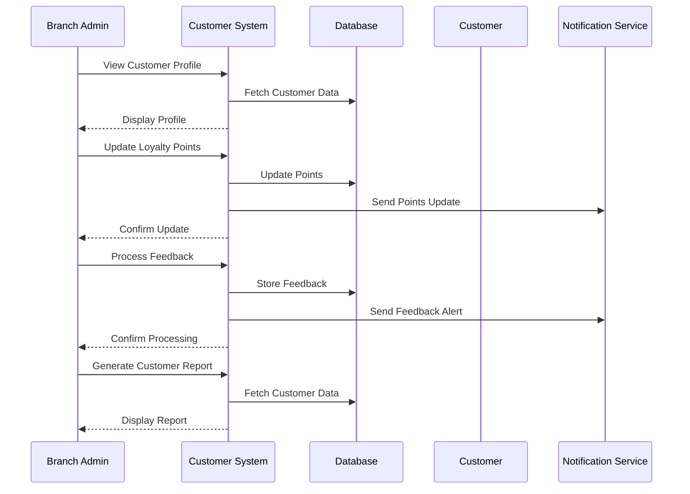

# Customer Management Use Case

## Overview
This document outlines the customer management use case for the branch admin, including customer service, loyalty program, and feedback management.

## Workflow

## Implementation Details

### Customer Service
1. View customer profiles
2. Handle customer requests
3. Process special orders
4. Manage customer accounts
5. Track customer preferences

### Loyalty Program
1. Update loyalty points
2. Process rewards
3. Handle tier upgrades
4. Manage promotions
5. Track program performance

### Feedback Management
1. Review customer feedback
2. Process complaints
3. Track satisfaction
4. Implement improvements
5. Monitor feedback trends

## Business Rules
1. Customer data must be protected
2. Loyalty points must be accurate
3. Feedback must be addressed
4. Reports must be generated
5. Privacy must be maintained

## Error Handling
1. Invalid customer data
2. Points calculation errors
3. Feedback processing failures
4. Database update errors
5. Notification failures

## Testing Strategy
1. Unit tests for customer updates
2. Integration tests for loyalty program
3. E2E tests for feedback
4. Performance tests for reports
5. Validation tests for business rules 