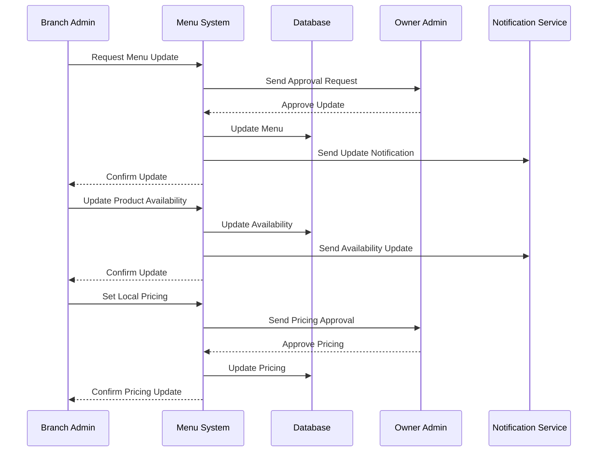

# Menu Management Use Case

## Overview
This document outlines the menu management use case for the branch admin, including menu updates, product availability, and local pricing.

## Workflow

## Implementation Details

### Menu Updates
1. Request menu changes
2. Wait for owner approval
3. Implement approved changes
4. Notify staff of updates
5. Monitor update impact

### Product Management
1. Update product availability
2. Manage local inventory
3. Handle special requests
4. Track popular items
5. Manage seasonal items

### Pricing Management
1. Set local prices
2. Request price changes
3. Implement approved prices
4. Monitor price impact
5. Track competitor prices

## Business Rules
1. Menu changes require owner approval
2. Product availability must be accurate
3. Local pricing must be justified
4. Updates must be communicated
5. Changes must be tracked

## Error Handling
1. Invalid update requests
2. Approval process failures
3. Database update errors
4. Notification failures
5. Pricing calculation errors

## Testing Strategy
1. Unit tests for menu updates
2. Integration tests for approvals
3. E2E tests for pricing changes
4. Performance tests for updates
5. Validation tests for business rules 