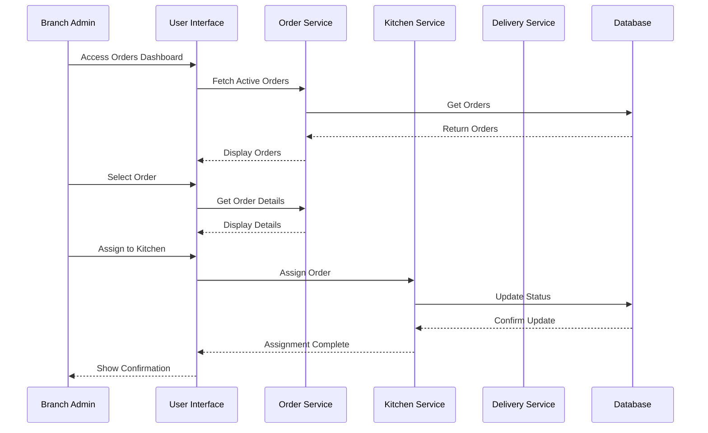
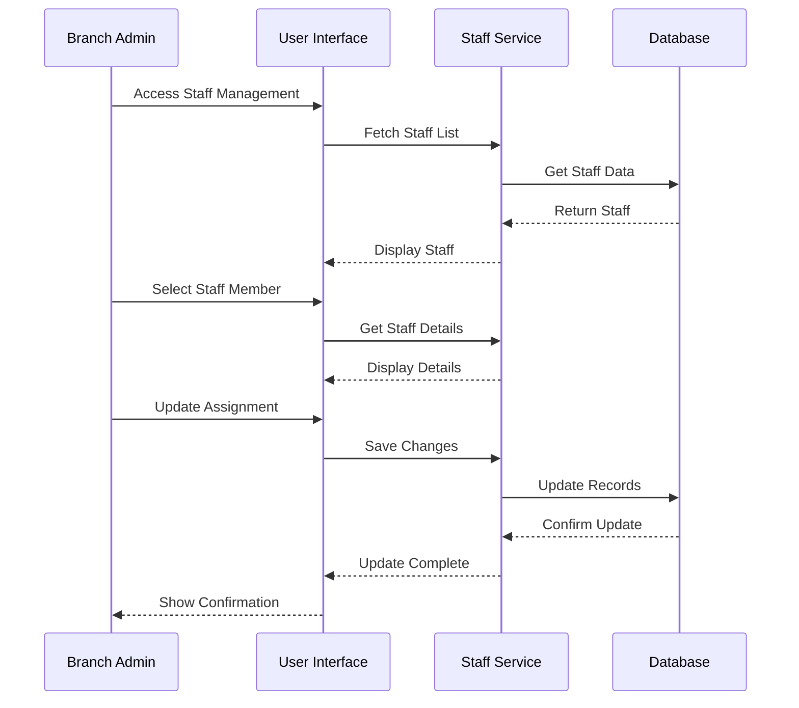
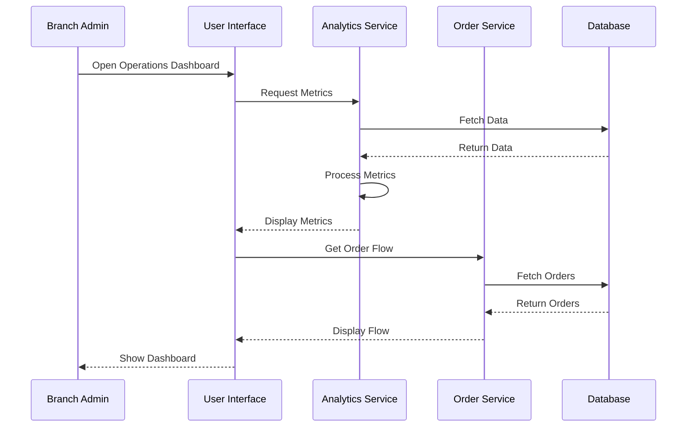

# Order Management - Branch Admin

## Overview
This document outlines the use cases for branch admins managing orders, coordinating staff, and monitoring branch operations.

## Use Cases

### 1. Manage Incoming Orders

#### Workflow Description
1. Branch admin logs into the system
2. Views incoming orders dashboard
3. Reviews order details
4. Assigns orders to kitchen staff
5. Monitors order preparation status
6. Coordinates with delivery staff
7. Updates order status
8. Handles order issues if any

#### Sequence Diagram

### 2. Coordinate Staff Assignments

#### Workflow Description
1. Branch admin views staff schedule
2. Reviews current staff assignments
3. Assigns staff to specific tasks
4. Updates staff schedules
5. Monitors staff performance
6. Handles staff requests
7. Updates staff records

#### Sequence Diagram

### 3. Monitor Branch Operations

#### Workflow Description
1. Branch admin accesses operations dashboard
2. Views real-time metrics
3. Monitors order flow
4. Checks staff performance
5. Reviews customer feedback
6. Identifies issues
7. Takes corrective actions
8. Generates reports

#### Sequence Diagram

## Integration Points
- Order Service
- Staff Management Service
- Kitchen Service
- Delivery Service
- Analytics Service
- Notification Service

## Business Rules
1. Only branch admin can assign staff
2. Orders must be assigned within 2 minutes
3. Staff assignments must follow labor laws
4. Performance metrics updated hourly
5. Critical issues require immediate attention

## Error Handling
1. Staff assignment conflicts
2. Order processing delays
3. System performance issues
4. Staff availability problems
5. Database synchronization errors

## Testing Strategy
1. Unit tests for order management
2. Integration tests for staff coordination
3. Performance tests for real-time monitoring
4. Security tests for admin access
5. End-to-end tests for complete workflows 