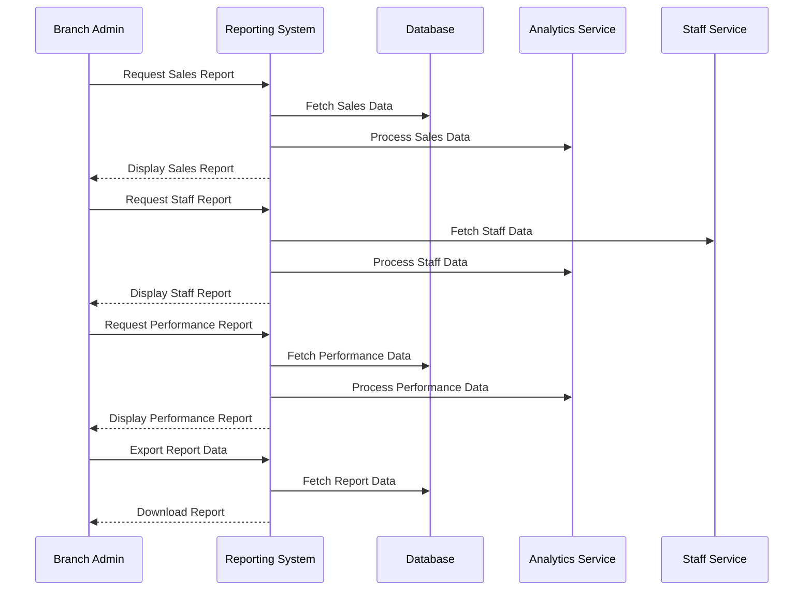

# Reporting Use Case

## Overview
This document outlines the reporting use case for the branch admin, including branch performance, sales analytics, and staff metrics.

## Workflow

## Implementation Details

### Sales Reporting
1. Generate daily sales reports
2. Analyze product performance
3. Track category sales
4. Monitor customer trends
5. Analyze payment methods

### Staff Reporting
1. Track staff performance
2. Monitor attendance
3. Analyze productivity
4. Track training progress
5. Monitor customer service

### Performance Reporting
1. Monitor branch efficiency
2. Track order processing
3. Analyze customer satisfaction
4. Monitor inventory levels
5. Track financial performance

## Business Rules
1. Reports must be accurate
2. Data must be up-to-date
3. Reports can be filtered
4. Data must be secure
5. Reports must be timely

## Error Handling
1. Data processing errors
2. Report generation failures
3. Database connectivity issues
4. Export failures
5. Authorization failures

## Testing Strategy
1. Unit tests for data processing
2. Integration tests for reports
3. E2E tests for exports
4. Performance tests for large datasets
5. Validation tests for business rules 