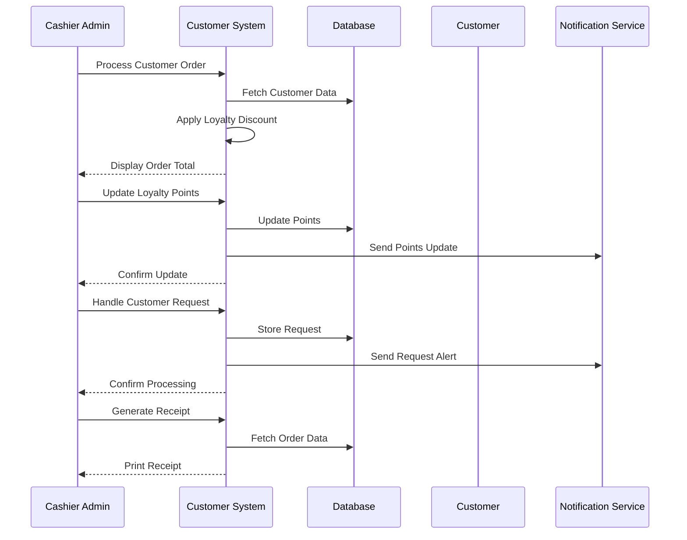

# Customer Management Use Case

## Overview
This document outlines the customer management use case for the cashier admin, including customer service, order processing, and loyalty program management.

## Workflow

## Implementation Details

### Order Processing
1. Process customer orders
2. Apply loyalty discounts
3. Handle special requests
4. Process payments
5. Generate receipts

### Loyalty Program
1. Update loyalty points
2. Apply loyalty discounts
3. Process rewards
4. Handle tier benefits
5. Track program usage

### Customer Service
1. Handle customer requests
2. Process complaints
3. Manage special orders
4. Track preferences
5. Provide assistance

## Business Rules
1. Orders must be accurate
2. Loyalty points must be correct
3. Discounts must be valid
4. Receipts must be generated
5. Customer data must be protected

## Error Handling
1. Invalid order data
2. Points calculation errors
3. Payment processing failures
4. Receipt generation errors
5. Database update errors

## Testing Strategy
1. Unit tests for order processing
2. Integration tests for loyalty program
3. E2E tests for customer service
4. Performance tests for transactions
5. Validation tests for business rules 