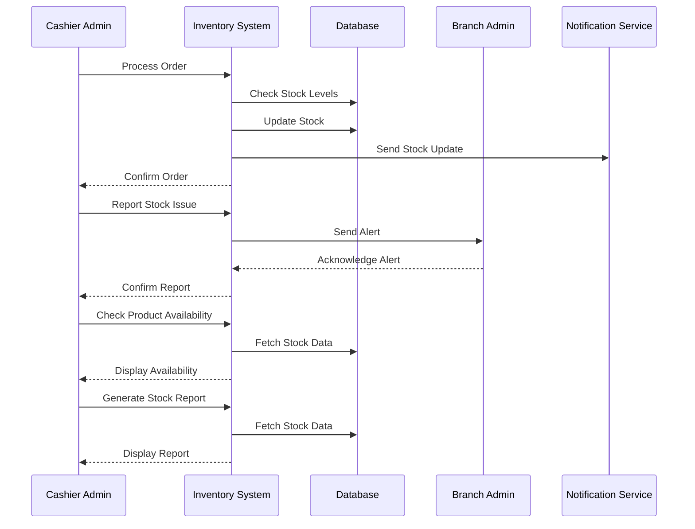

# Inventory Updates Use Case

## Overview
This document outlines the inventory updates use case for the cashier admin, including stock tracking, order processing, and inventory alerts.

## Workflow

## Implementation Details

### Order Processing
1. Check stock availability
2. Update stock levels
3. Process order items
4. Handle stock adjustments
5. Generate stock updates

### Stock Management
1. Monitor stock levels
2. Report stock issues
3. Check product availability
4. Handle stock returns
5. Track stock movements

### Inventory Alerts
1. Receive low stock alerts
2. Report stock discrepancies
3. Handle stock emergencies
4. Process stock requests
5. Track alert responses

## Business Rules
1. Stock levels must be accurate
2. Orders must be verified
3. Alerts must be addressed
4. Reports must be generated
5. Updates must be timely

## Error Handling
1. Invalid stock quantities
2. Order processing failures
3. Alert system errors
4. Database update errors
5. Notification failures

## Testing Strategy
1. Unit tests for stock updates
2. Integration tests for orders
3. E2E tests for alerts
4. Performance tests for updates
5. Validation tests for business rules 