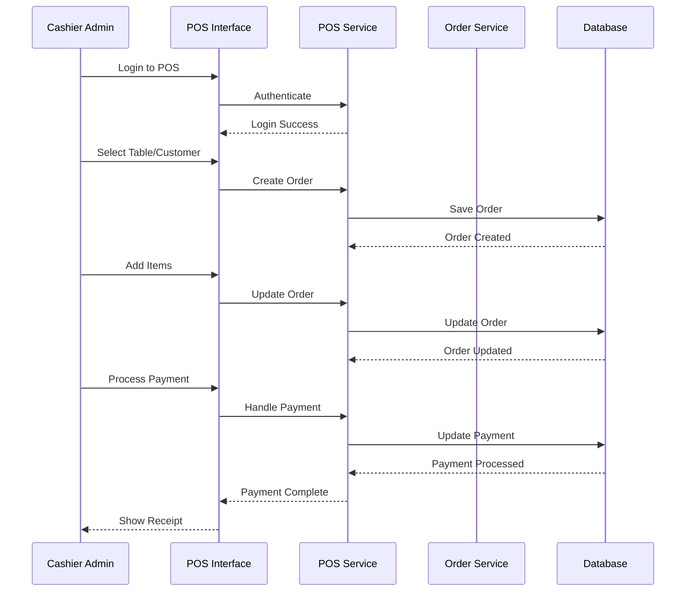
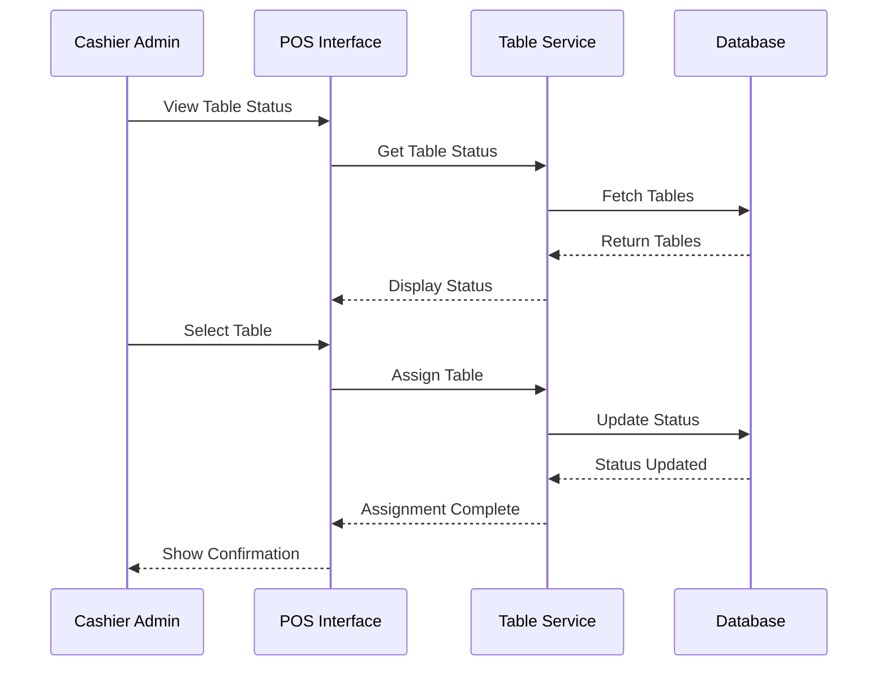
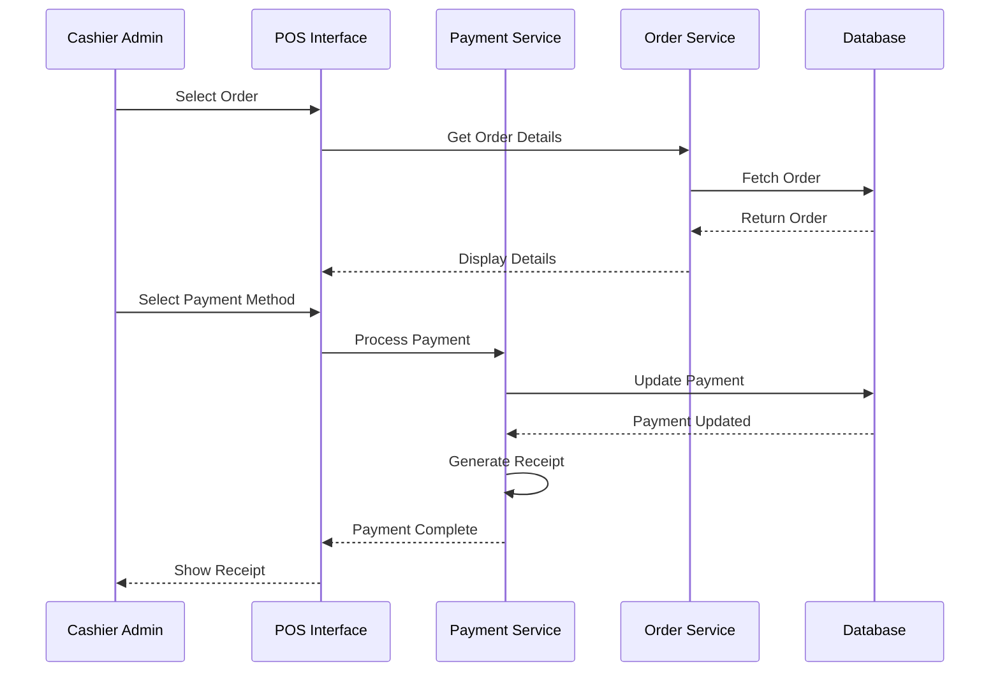

# POS Operations - Cashier Admin

## Overview
This document outlines the use cases for cashier admins managing on-site orders, processing payments, and handling customer transactions.

## Use Cases

### 1. Process On-site Orders

#### Workflow Description
1. Cashier admin logs into POS system
2. Selects table or walk-in customer
3. Takes customer order
4. Enters items into system
5. Applies modifications if needed
6. Calculates total
7. Processes payment
8. Generates receipt
9. Updates order status

#### Sequence Diagram

### 2. Handle Table Management

#### Workflow Description
1. Cashier admin views table status
2. Assigns table to new order
3. Monitors table occupancy
4. Updates table status
5. Handles table transfers
6. Releases tables after payment
7. Updates floor plan

#### Sequence Diagram

### 3. Process Payments and Refunds

#### Workflow Description
1. Cashier admin selects order
2. Reviews order total
3. Selects payment method
4. Processes payment
5. Handles partial payments
6. Processes refunds if needed
7. Generates payment receipt
8. Updates payment records

#### Sequence Diagram

## Integration Points
- POS Service
- Table Management Service
- Payment Service
- Order Service
- Receipt Generation Service

## Business Rules
1. Cashier must be logged in to process orders
2. Table must be assigned before order creation
3. Payment must match order total
4. Refunds require manager approval
5. Receipts must be generated for all transactions

## Error Handling
1. Payment processing failures
2. Table assignment conflicts
3. System connectivity issues
4. Invalid payment methods
5. Database transaction errors

## Testing Strategy
1. Unit tests for payment processing
2. Integration tests for table management
3. End-to-end tests for order flow
4. Security tests for payment handling
5. Performance tests for POS operations 