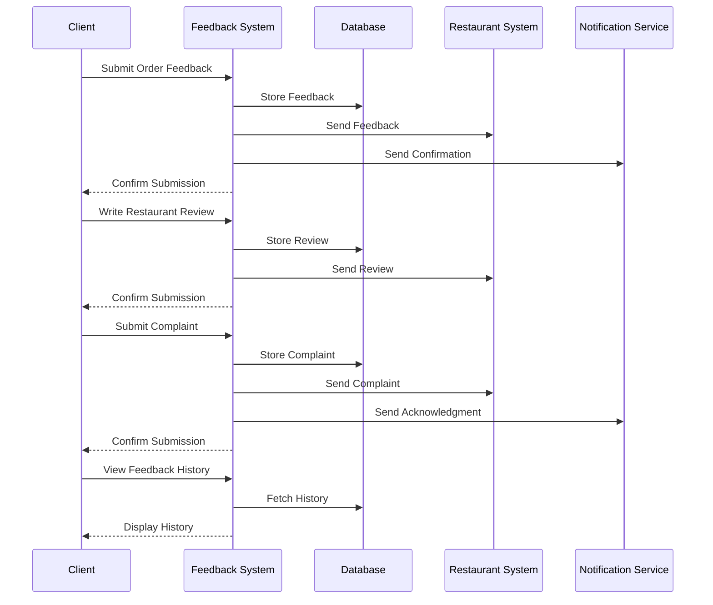

# Feedback System Use Case

## Overview
This document outlines the feedback system use case for clients, including order feedback, restaurant reviews, and complaint management.

## Workflow

## Implementation Details

### Order Feedback
1. Rate order experience
2. Provide order comments
3. Rate food quality
4. Rate delivery service
5. Track feedback status

### Restaurant Reviews
1. Write detailed reviews
2. Rate overall experience
3. Rate specific aspects
4. Add photos/videos
5. Track review status

### Complaint Management
1. Submit complaints
2. Track complaint status
3. Receive responses
4. Provide follow-up
5. Rate resolution

## Business Rules
1. Feedback must be honest
2. Reviews must be appropriate
3. Complaints must be addressed
4. Responses must be timely
5. History must be maintained

## Error Handling
1. Submission failures
2. Database errors
3. Notification failures
4. Response processing errors
5. History retrieval errors

## Testing Strategy
1. Unit tests for submissions
2. Integration tests for processing
3. E2E tests for responses
4. Performance tests for history
5. Validation tests for business rules 