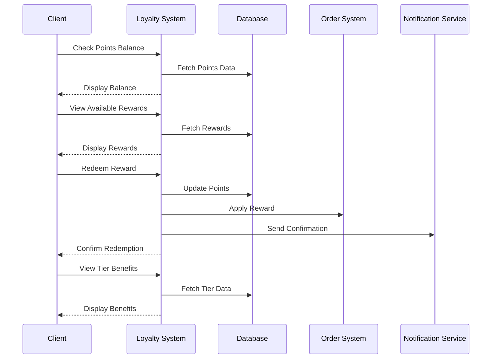

# Loyalty Program Use Case

## Overview
This document outlines the loyalty program use case for clients, including points management, rewards redemption, and tier benefits.

## Workflow

## Implementation Details

### Points Management
1. Track points balance
2. View points history
3. Check points expiry
4. Monitor tier progress
5. View points value

### Rewards Redemption
1. Browse available rewards
2. Select reward to redeem
3. Apply reward to order
4. Track redemption history
5. View reward status

### Tier Benefits
1. View current tier
2. Check tier benefits
3. Monitor tier progress
4. View tier requirements
5. Track tier expiration

## Business Rules
1. Points must be accurate
2. Rewards must be available
3. Redemptions must be valid
4. Tier benefits must be current
5. Points must not expire prematurely

## Error Handling
1. Points calculation errors
2. Reward redemption failures
3. Tier update errors
4. Database errors
5. Notification failures

## Testing Strategy
1. Unit tests for points
2. Integration tests for rewards
3. E2E tests for redemption
4. Performance tests for updates
5. Validation tests for business rules 