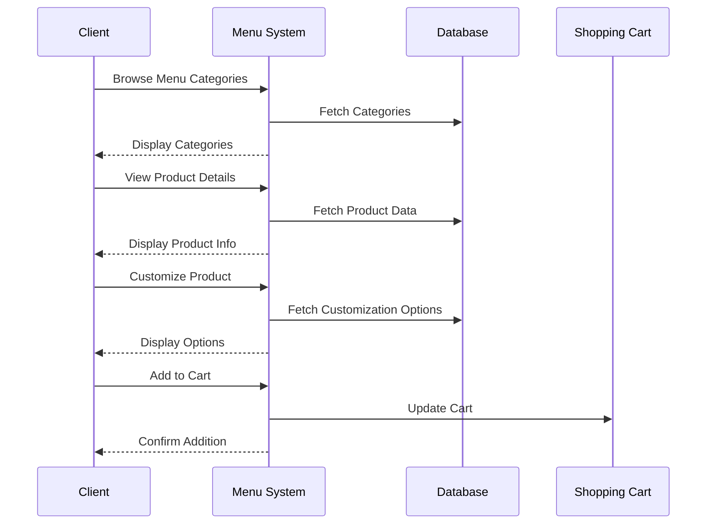

# Menu Browsing Use Case

## Overview
This document outlines the menu browsing use case for clients, including menu navigation, product details, and customization options.

## Workflow

## Implementation Details

### Menu Navigation
1. Browse categories
2. View product lists
3. Search products
4. Filter products
5. Sort products

### Product Details
1. View product information
2. Check availability
3. View pricing
4. See customization options
5. Read product reviews

### Customization
1. Select variations
2. Choose options
3. Add special requests
4. View price adjustments
5. Save preferences

## Business Rules
1. Menu must be up-to-date
2. Products must be available
3. Prices must be accurate
4. Customization must be valid
5. Cart must be maintained

## Error Handling
1. Menu loading failures
2. Product not found
3. Customization errors
4. Cart update failures
5. Database errors

## Testing Strategy
1. Unit tests for navigation
2. Integration tests for products
3. E2E tests for customization
4. Performance tests for loading
5. Validation tests for business rules 