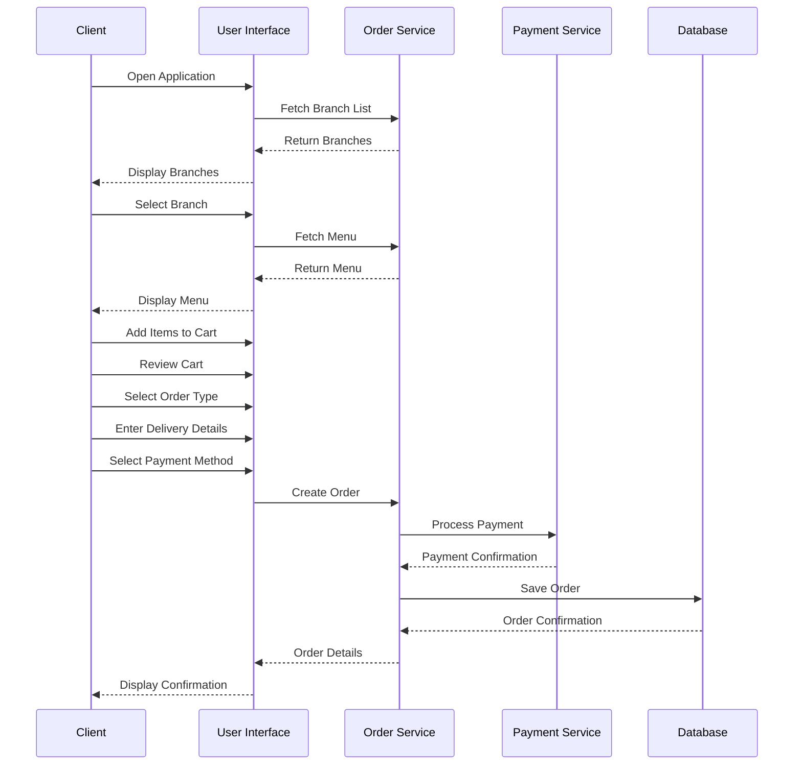
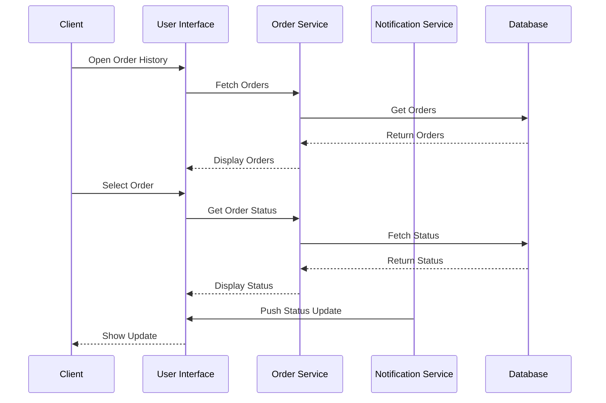
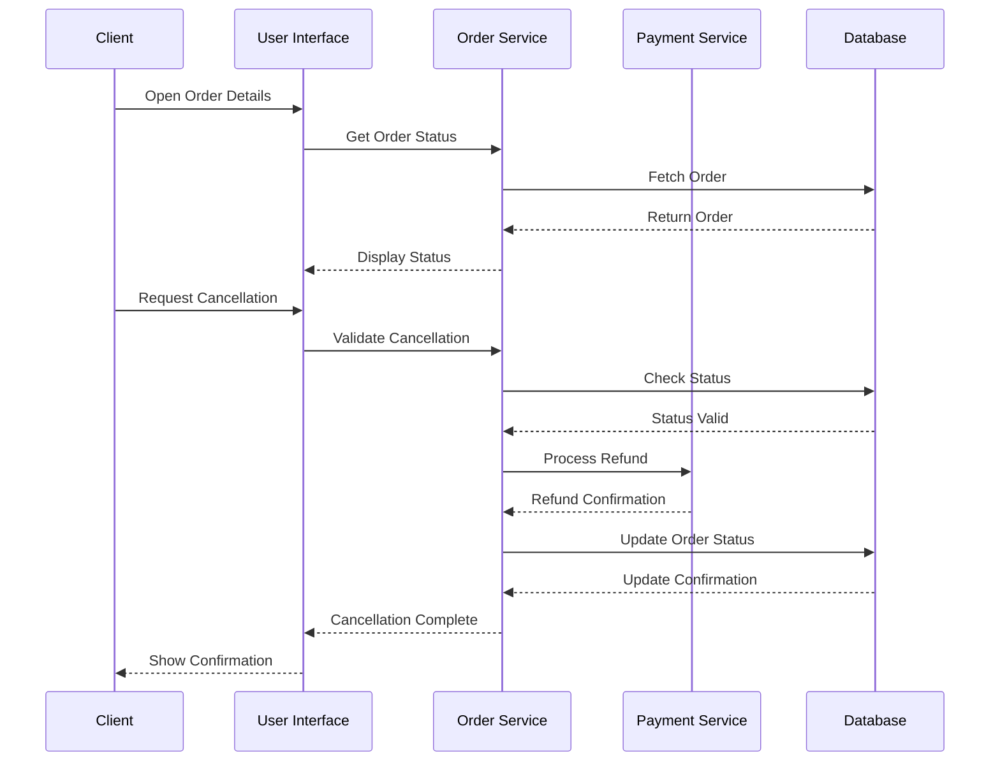

# Order Placement - Client

## Overview
This document outlines the use cases for clients placing and managing orders through the application.

## Use Cases

### 1. Place New Order

#### Workflow Description
1. Client opens the application
2. Selects preferred branch
3. Browses menu categories
4. Adds items to cart
5. Reviews cart and applies modifications
6. Selects order type (delivery/pickup)
7. Provides delivery details (if applicable)
8. Selects payment method
9. Confirms order
10. Receives order confirmation

#### Sequence Diagram

### 2. Track Order Status

#### Workflow Description
1. Client opens order history
2. Selects active order
3. Views current order status
4. Receives real-time updates
5. Can contact support if needed

#### Sequence Diagram

### 3. Cancel Order

#### Workflow Description
1. Client opens order details
2. Checks order status
3. Initiates cancellation
4. System validates cancellation eligibility
5. System processes cancellation
6. Client receives confirmation
7. Refund processed if applicable

#### Sequence Diagram

## Integration Points
- Order Service
- Payment Service
- Notification Service
- Branch Service
- Menu Service

## Business Rules
1. Orders can only be cancelled within 5 minutes of placement
2. Payment must be confirmed before order processing
3. Delivery orders require valid address
4. Pickup orders require estimated pickup time
5. Order modifications only allowed before preparation starts

## Error Handling
1. Invalid payment method
2. Out of stock items
3. Branch closed
4. Invalid delivery address
5. System errors during order placement

## Testing Strategy
1. Unit tests for order creation
2. Integration tests for payment processing
3. End-to-end tests for order flow
4. Performance tests for real-time updates
5. Security tests for payment processing 