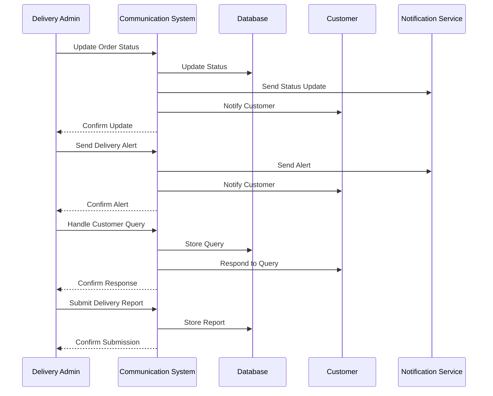

# Customer Communication Use Case

## Overview
This document outlines the customer communication use case for the delivery admin, including order updates, delivery notifications, and customer feedback.

## Workflow

## Implementation Details

### Order Updates
1. Update order status
2. Send status notifications
3. Handle status changes
4. Track order progress
5. Manage delivery timing

### Delivery Notifications
1. Send delivery alerts
2. Handle customer responses
3. Manage delivery updates
4. Track delivery progress
5. Handle delivery issues

### Customer Feedback
1. Handle customer queries
2. Process customer feedback
3. Manage complaints
4. Track satisfaction
5. Implement improvements

## Business Rules
1. Updates must be timely
2. Notifications must be clear
3. Queries must be addressed
4. Feedback must be processed
5. Reports must be accurate

## Error Handling
1. Notification failures
2. Status update errors
3. Query processing failures
4. Database update errors
5. Communication failures

## Testing Strategy
1. Unit tests for updates
2. Integration tests for notifications
3. E2E tests for communication
4. Performance tests for alerts
5. Validation tests for business rules 