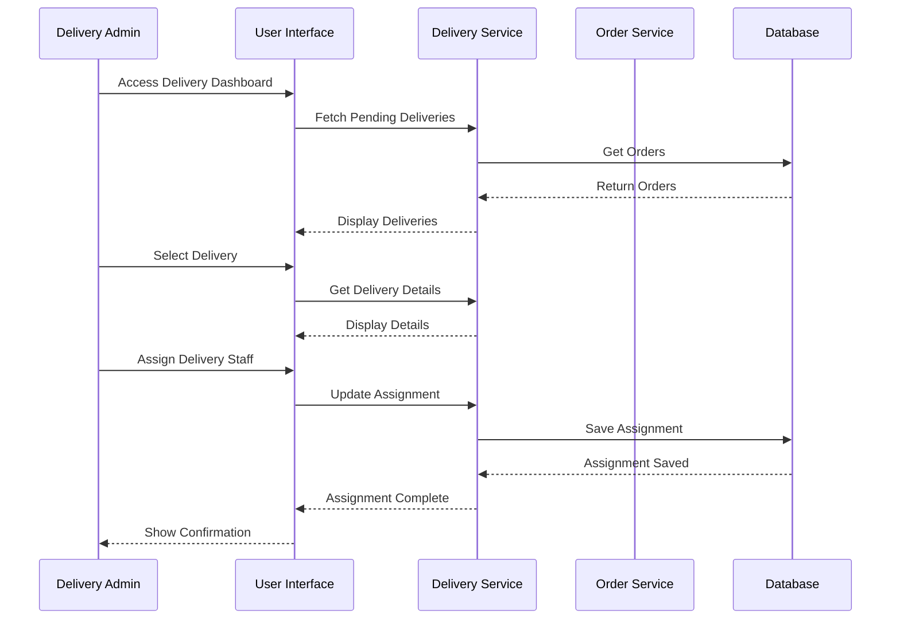
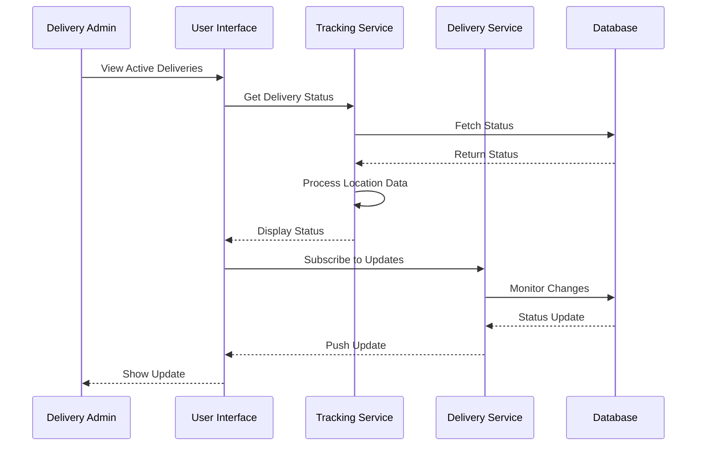
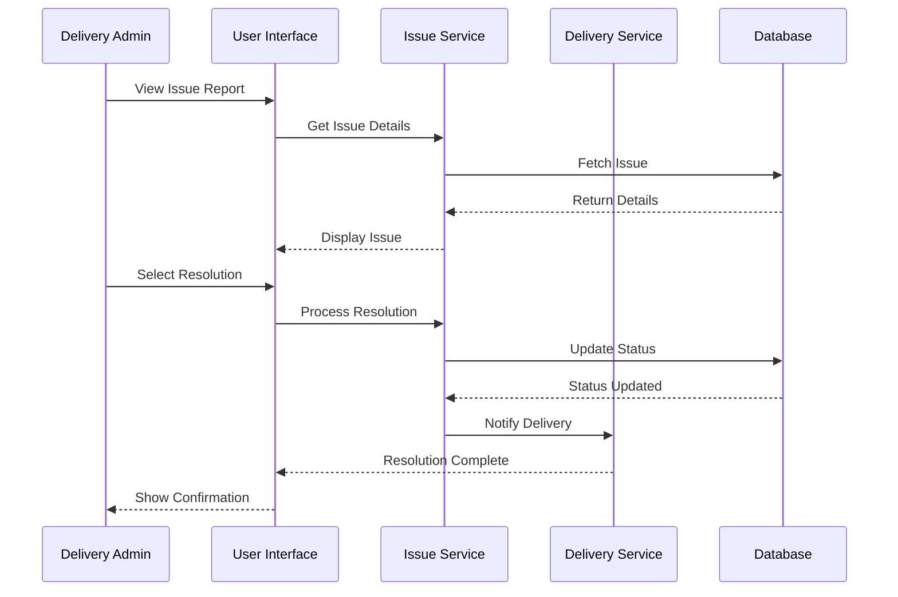

# Delivery Management - Delivery Admin

## Overview
This document outlines the use cases for delivery admins managing delivery orders, coordinating delivery staff, and tracking deliveries.

## Use Cases

### 1. Manage Delivery Assignments

#### Workflow Description
1. Delivery admin logs into system
2. Views pending deliveries
3. Reviews order details
4. Assigns delivery to staff
5. Monitors delivery progress
6. Updates delivery status
7. Handles delivery issues
8. Confirms delivery completion

#### Sequence Diagram

### 2. Track Delivery Progress

#### Workflow Description
1. Delivery admin views active deliveries
2. Monitors delivery staff location
3. Tracks delivery status
4. Receives real-time updates
5. Handles delays or issues
6. Communicates with customers
7. Updates delivery records

#### Sequence Diagram

### 3. Handle Delivery Issues

#### Workflow Description
1. Delivery admin receives issue notification
2. Reviews issue details
3. Contacts delivery staff
4. Coordinates with customer
5. Implements solution
6. Updates delivery status
7. Documents resolution
8. Follows up if needed

#### Sequence Diagram

## Integration Points
- Delivery Service
- Tracking Service
- Order Service
- Notification Service
- Customer Service
- Staff Management Service

## Business Rules
1. Deliveries must be assigned within 5 minutes
2. Staff location must be tracked in real-time
3. Issues must be addressed within 15 minutes
4. Customer must be notified of delays
5. Delivery status must be updated every 5 minutes

## Error Handling
1. Delivery assignment failures
2. Location tracking issues
3. Communication problems
4. Customer unavailability
5. System connectivity errors

## Testing Strategy
1. Unit tests for delivery assignment
2. Integration tests for tracking
3. End-to-end tests for delivery flow
4. Performance tests for real-time updates
5. Security tests for location data 