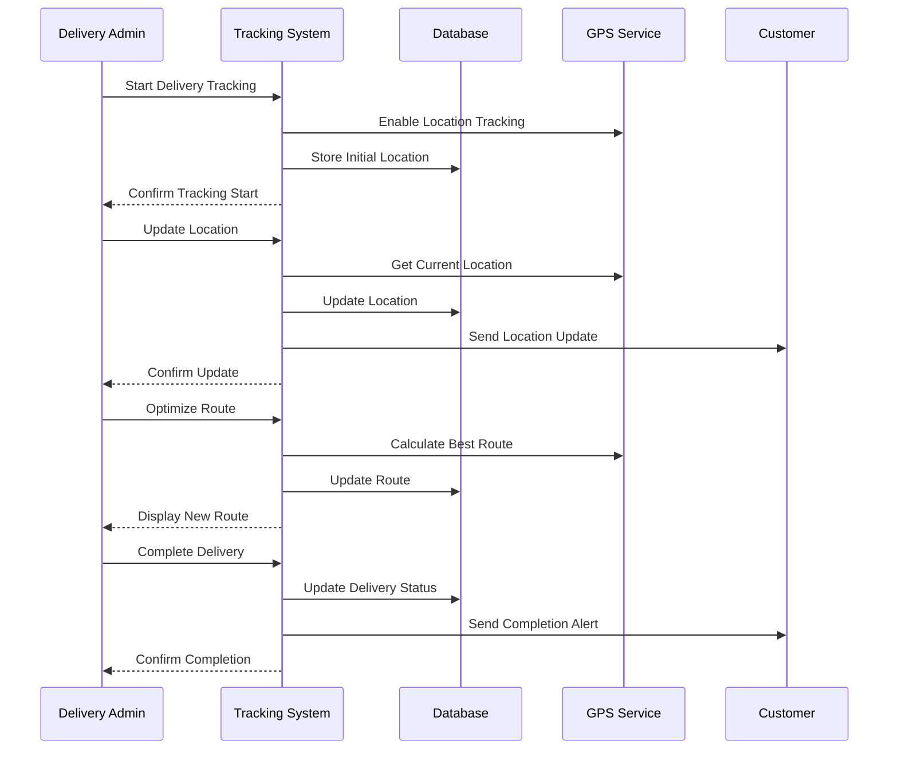

# Real-time Tracking Use Case

## Overview
This document outlines the real-time tracking use case for the delivery admin, including location tracking, delivery status, and route optimization.

## Workflow

## Implementation Details

### Location Tracking
1. Enable GPS tracking
2. Update location data
3. Store location history
4. Monitor movement
5. Track delivery progress

### Delivery Status
1. Update delivery status
2. Send status notifications
3. Handle status changes
4. Track delivery timing
5. Monitor delivery progress

### Route Optimization
1. Calculate best routes
2. Update delivery routes
3. Handle route changes
4. Track route efficiency
5. Monitor delivery times

## Business Rules
1. Location must be accurate
2. Updates must be frequent
3. Routes must be optimal
4. Status must be current
5. Notifications must be timely

## Error Handling
1. GPS signal loss
2. Location update failures
3. Route calculation errors
4. Database update errors
5. Notification failures

## Testing Strategy
1. Unit tests for tracking
2. Integration tests for GPS
3. E2E tests for routes
4. Performance tests for updates
5. Validation tests for business rules 