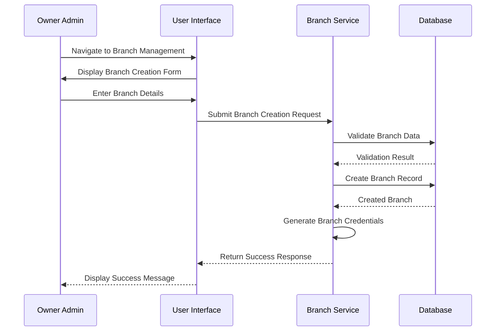
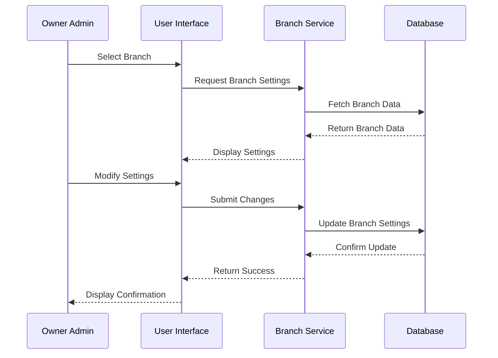
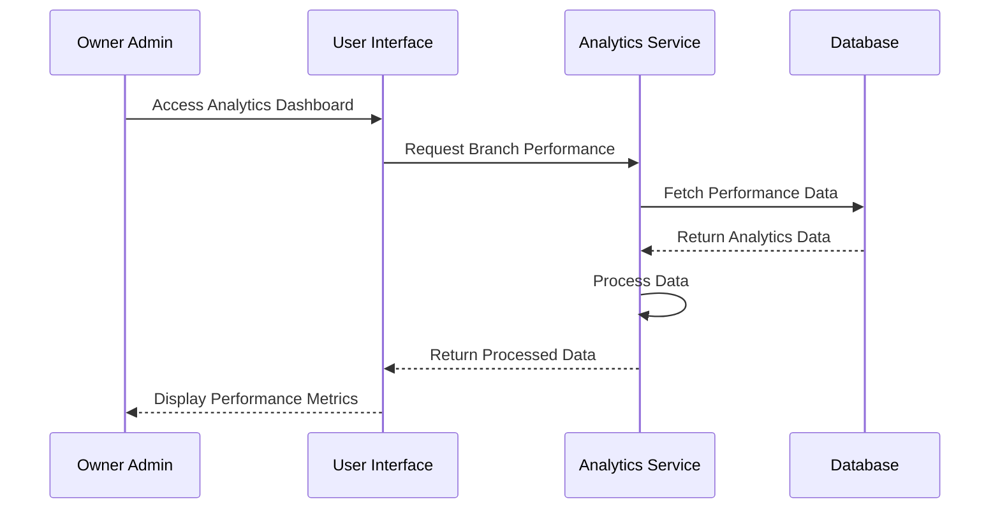

# Branch Management - Owner Admin

## Overview
This document outlines the use cases for branch management by the owner admin, including branch creation, configuration, and monitoring.

## Use Cases

### 1. Create New Branch

#### Workflow Description
1. Owner admin logs into the system
2. Navigates to branch management section
3. Initiates new branch creation
4. Enters branch details (name, location, contact info)
5. Configures branch settings (operating hours, delivery radius)
6. System validates the information
7. System creates the branch
8. System generates branch credentials
9. Owner admin receives confirmation

#### Sequence Diagram

### 2. Configure Branch Settings

#### Workflow Description
1. Owner admin selects a branch
2. Views current branch settings
3. Modifies settings (operating hours, delivery radius, etc.)
4. System validates changes
5. System updates branch configuration
6. Owner admin receives confirmation

#### Sequence Diagram

### 3. Monitor Branch Performance

#### Workflow Description
1. Owner admin accesses analytics dashboard
2. Selects branch to monitor
3. Views performance metrics (orders, revenue, etc.)
4. Filters data by time period
5. System generates reports
6. Owner admin reviews performance

#### Sequence Diagram

## Integration Points
- Branch Service
- Analytics Service
- User Management Service
- Notification Service

## Business Rules
1. Only owner admin can create new branches
2. Branch settings can only be modified by owner admin
3. Performance metrics are updated in real-time
4. Branch creation requires valid location data
5. Operating hours must be within legal limits

## Error Handling
1. Invalid branch data
2. Duplicate branch location
3. Invalid operating hours
4. System errors during creation
5. Database connection issues

## Testing Strategy
1. Unit tests for branch creation
2. Integration tests for settings update
3. Performance tests for analytics
4. Security tests for admin access
5. End-to-end tests for complete workflows 