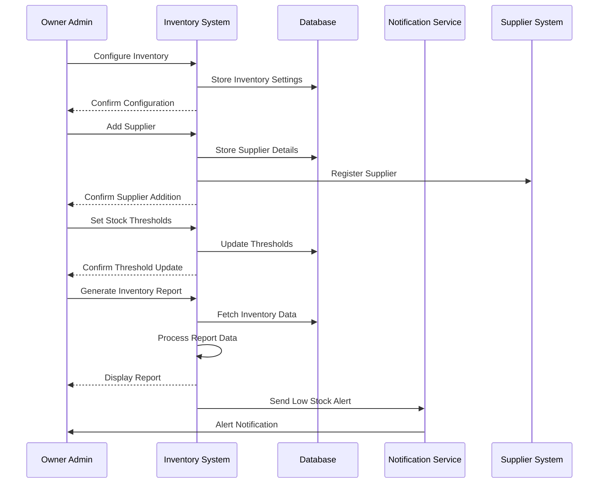

# Inventory Management Use Case

## Overview
This document outlines the inventory management use case for the owner admin, including stock tracking, supplier management, and inventory reporting.

## Workflow

## Implementation Details

### Inventory Configuration
1. Set up inventory tracking
2. Configure stock thresholds
3. Define alert rules
4. Set up supplier management

### Stock Management
1. Track stock levels
2. Monitor stock movements
3. Handle stock adjustments
4. Manage stock alerts
5. Process stock returns

### Supplier Management
1. Add/Edit supplier details
2. Manage supplier orders
3. Track supplier performance
4. Handle supplier payments
5. Manage supplier contracts

### Reporting
1. Generate inventory reports
2. Analyze stock trends
3. Monitor supplier performance
4. Track stock movements
5. Analyze stock costs

## Business Rules
1. Stock levels must be accurate
2. Low stock alerts must be sent
3. Supplier orders must be tracked
4. Stock adjustments require approval
5. Reports must be generated regularly

## Error Handling
1. Invalid stock quantities
2. Supplier registration failures
3. Report generation errors
4. Alert system failures
5. Database constraints

## Testing Strategy
1. Unit tests for stock tracking
2. Integration tests for supplier management
3. E2E tests for reporting
4. Performance tests for large inventories
5. Validation tests for business rules 