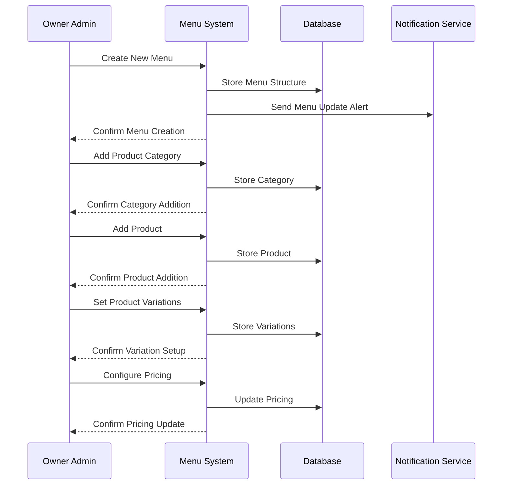

# Menu Management Use Case

## Overview
This document outlines the menu management use case for the owner admin, including menu creation, product management, and pricing strategies.

## Workflow

## Implementation Details

### Menu Creation
1. Owner admin creates a new menu
2. System validates menu structure
3. Menu is stored in database
4. Branch admins are notified

### Product Management
1. Add/Edit product categories
2. Configure product details
3. Set product variations
4. Manage product options
5. Update product availability

### Pricing Strategy
1. Set base prices
2. Configure variation pricing
3. Set option prices
4. Apply discounts
5. Update pricing rules

## Business Rules
1. Menu changes require owner approval
2. Products must belong to categories
3. Pricing changes must be justified
4. Product variations must have price adjustments
5. Options must have defined prices

## Error Handling
1. Invalid menu structure
2. Duplicate product names
3. Invalid price values
4. Missing required fields
5. Database constraints

## Testing Strategy
1. Unit tests for menu creation
2. Integration tests for product management
3. E2E tests for pricing updates
4. Validation tests for business rules
5. Performance tests for large menus 