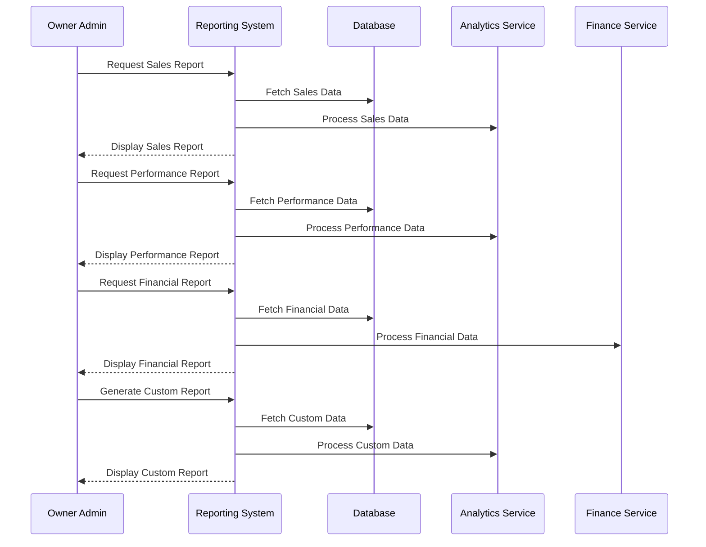

# Reporting System Use Case

## Overview
This document outlines the reporting system use case for the owner admin, including sales analytics, performance metrics, and financial reporting.

## Workflow

## Implementation Details

### Sales Reporting
1. Generate daily sales reports
2. Analyze product performance
3. Track category sales
4. Monitor branch performance
5. Analyze customer trends

### Performance Reporting
1. Track staff performance
2. Monitor branch efficiency
3. Analyze delivery metrics
4. Track order processing times
5. Monitor customer satisfaction

### Financial Reporting
1. Generate revenue reports
2. Track expenses
3. Analyze profit margins
4. Monitor payment methods
5. Track financial trends

### Custom Reporting
1. Create custom report templates
2. Configure report parameters
3. Schedule report generation
4. Export report data
5. Share reports with stakeholders

## Business Rules
1. Reports must be accurate
2. Data must be up-to-date
3. Reports can be filtered by date
4. Reports can be filtered by branch
5. Custom reports require approval

## Error Handling
1. Data processing errors
2. Report generation failures
3. Database connectivity issues
4. Invalid date ranges
5. Authorization failures

## Testing Strategy
1. Unit tests for data processing
2. Integration tests for report generation
3. E2E tests for report delivery
4. Performance tests for large datasets
5. Validation tests for business rules 