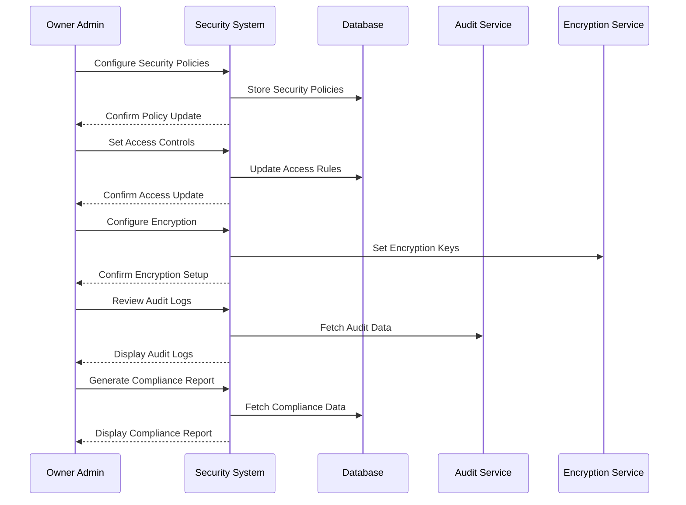

# Security and Compliance Use Case

## Overview
This document outlines the security and compliance use case for the owner admin, including security policies, audit logging, and compliance management.

## Workflow

## Implementation Details

### Security Policy Management
1. Define access control policies
2. Configure password policies
3. Set up data protection rules
4. Manage security updates
5. Configure audit logging

### Access Control
1. Manage user roles
2. Configure permissions
3. Set up authentication rules
4. Manage session controls
5. Configure authorization rules

### Data Protection
1. Configure encryption
2. Manage encryption keys
3. Set up data retention
4. Configure backups
5. Manage data access

### Compliance Management
1. Monitor GDPR compliance
2. Track PCI DSS compliance
3. Manage data protection laws
4. Monitor industry standards
5. Track local regulations

## Business Rules
1. Security policies must be enforced
2. Access controls must be maintained
3. Audit logs must be preserved
4. Encryption must be active
5. Compliance must be verified

## Error Handling
1. Policy enforcement failures
2. Access control violations
3. Encryption failures
4. Audit logging errors
5. Compliance violations

## Testing Strategy
1. Unit tests for security policies
2. Integration tests for access control
3. Security penetration tests
4. Compliance verification tests
5. Audit logging tests 