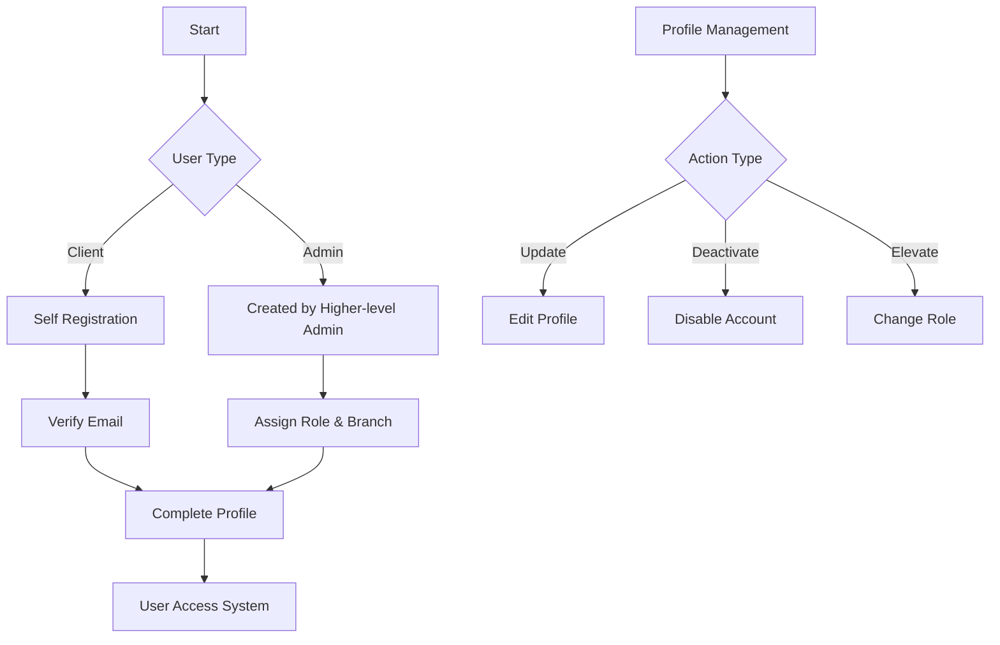
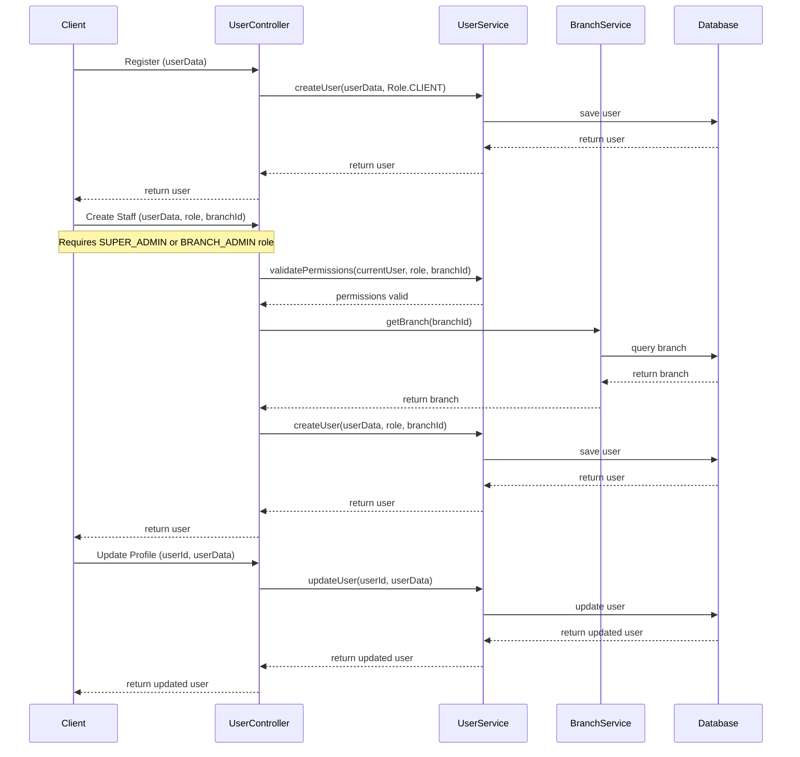

# User Management System Documentation

## Overview
The user management system handles user operations, profiles, and role management across the platform.

## Workflow Diagram



## Sequence Diagram



## NestJS Implementation

### Module Structure
```typescript
// users.module.ts
@Module({
  imports: [BranchesModule],
  controllers: [UsersController],
  providers: [UsersService],
  exports: [UsersService],
})
export class UsersModule {}
```

### Controller
```typescript
// users.controller.ts
@Controller('users')
export class UsersController {
  constructor(private readonly usersService: UsersService) {}

  @Post()
  @UseGuards(JwtAuthGuard, RolesGuard)
  @Roles(Role.SUPER_ADMIN, Role.BRANCH_ADMIN)
  create(@Body() createUserDto: CreateUserDto, @Request() req) {
    // Validate branch access if branch admin
    if (req.user.role === Role.BRANCH_ADMIN && 
        createUserDto.branchId !== req.user.branchId) {
      throw new ForbiddenException('Cannot create user for different branch');
    }
    
    return this.usersService.create(createUserDto);
  }

  @Post('register')
  register(@Body() registerUserDto: RegisterUserDto) {
    return this.usersService.register(registerUserDto);
  }

  @Get()
  @UseGuards(JwtAuthGuard, RolesGuard)
  @Roles(Role.SUPER_ADMIN, Role.BRANCH_ADMIN)
  findAll(@Request() req) {
    if (req.user.role === Role.SUPER_ADMIN) {
      return this.usersService.findAll();
    } else {
      return this.usersService.findByBranch(req.user.branchId);
    }
  }

  // Other methods
}
```

### Service
```typescript
// users.service.ts
@Injectable()
export class UsersService {
  constructor(private prisma: PrismaService) {}

  async create(createUserDto: CreateUserDto): Promise<User> {
    const hashedPassword = await bcrypt.hash(createUserDto.password, 10);
    return this.prisma.user.create({
      data: {
        ...createUserDto,
        password: hashedPassword,
      },
    });
  }

  async register(registerUserDto: RegisterUserDto): Promise<User> {
    const hashedPassword = await bcrypt.hash(registerUserDto.password, 10);
    return this.prisma.user.create({
      data: {
        ...registerUserDto,
        role: Role.CLIENT,
        password: hashedPassword,
      },
    });
  }

  // Other methods
}
```

## Database Schema (Prisma)

```prisma
model User {
  id            String      @id @default(auto()) @map("_id") @db.ObjectId
  email         String      @unique
  password      String
  name          String
  phone         String?
  role          Role        @default(CLIENT)
  branchId      String?     @db.ObjectId
  branch        Branch?     @relation(fields: [branchId], references: [id])
  clientOrders  Order[]     @relation("ClientOrders")
  deliveryOrders Order[]    @relation("DeliveryOrders")
  notifications Notification[]
  createdAt     DateTime    @default(now())
  updatedAt     DateTime    @updatedAt
}

enum Role {
  SUPER_ADMIN
  BRANCH_ADMIN
  CASHIER
  DELIVERY
  CLIENT
}
```

## Integration Points

### Users → Authentication
- User data used for authentication
- Role information impacts authorization

### Users → Branches
- Branch admins are assigned to specific branches
- Cashiers and delivery staff linked to specific branches

### Users → Orders
- Clients place orders
- Delivery staff receive order assignments
- Cashiers manage orders and payments

## Testing Strategy

### Unit Tests
```typescript
// users.service.spec.ts
describe('UsersService', () => {
  let service: UsersService;
  let prisma: PrismaService;
  
  beforeEach(async () => {
    const module = await Test.createTestingModule({
      providers: [
        UsersService,
        {
          provide: PrismaService,
          useValue: {
            user: {
              create: jest.fn(),
              findUnique: jest.fn(),
              findMany: jest.fn(),
              update: jest.fn(),
              delete: jest.fn(),
            },
          },
        },
      ],
    }).compile();
    
    service = module.get<UsersService>(UsersService);
    prisma = module.get<PrismaService>(PrismaService);
  });
  
  it('should create a user', async () => {
    // Test implementation
  });
  
  it('should handle user registration', async () => {
    // Test implementation
  });
});
```

### E2E Tests
```typescript
// users.e2e-spec.ts
describe('Users (e2e)', () => {
  let app: INestApplication;
  
  beforeEach(async () => {
    const moduleFixture = await Test.createTestingModule({
      imports: [AppModule],
    }).compile();
    
    app = moduleFixture.createNestApplication();
    await app.init();
  });
  
  it('/users/register (POST) - should register a client user', () => {
    // Test implementation
  });
  
  it('/users (POST) - should require admin role', () => {
    // Test implementation
  });
});
``` 